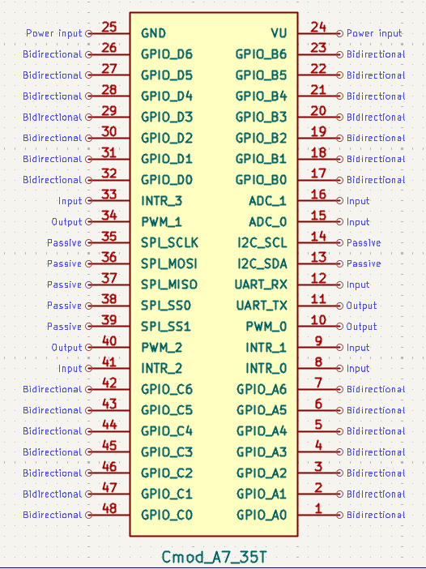
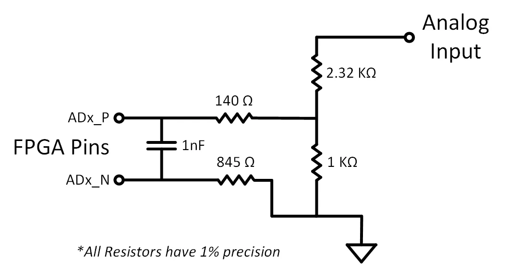

# Cmod A7-35T Pin Specification

## 1. DIP Connector Overview

The Cmod A7-35T has a 48-pin DIP connector (J1). All digital I/O pins operate at **LVCMOS33** (3.3 V logic level) with **no series resistors**.

*Figure 1. U1 Cmod A7-35T DIP Pinout (custom schematic symbol)*

| Category | Count |
|----------|-------|
| GPIO (4 groups × 7-bit) | 28 |
| External Interrupts | 4 |
| PWM Outputs | 3 |
| UART 1 (TX + RX) | 2 |
| I2C (SCL + SDA) | 2 |
| SPI (SCLK/MOSI/MISO/SS×2) | 5 |
| Analog Inputs (XADC) | 2 |
| Power (VU + GND) | 2 |
| **Total** | **48** |

---

## 2. Pin Map — Left Side (Pin 1–24)

| DIP Pin | Signal Name | FPGA Pin | Direction | Function |
|---------|-------------|----------|-----------|----------|
| 1 | GPIO_A0 | M3 | I/O | General purpose GPIO, Group A bit 0 |
| 2 | GPIO_A1 | L3 | I/O | General purpose GPIO, Group A bit 1 |
| 3 | GPIO_A2 | A16 | I/O | General purpose GPIO, Group A bit 2 |
| 4 | GPIO_A3 | K3 | I/O | General purpose GPIO, Group A bit 3 |
| 5 | GPIO_A4 | C15 | I/O | General purpose GPIO, Group A bit 4 |
| 6 | GPIO_A5 | H1 | I/O | General purpose GPIO, Group A bit 5 |
| 7 | GPIO_A6 | A15 | I/O | General purpose GPIO, Group A bit 6 |
| 8 | INTR_0 | B15 | Input | External interrupt input 0 |
| 9 | INTR_1 | A14 | Input | External interrupt input 1 |
| 10 | PWM_0 | J3 | Output | PWM output channel 0 (axi_timer) |
| 11 | UART_TX | J1 | Output | UART 1 transmit |
| 12 | UART_RX | K2 | Input | UART 1 receive |
| 13 | I2C_SCL | L1 | I/O (open-drain) | I2C clock (external 4.7 kΩ pull-up recommended) |
| 14 | I2C_SDA | L2 | I/O (open-drain) | I2C data (external 4.7 kΩ pull-up recommended) |
| 15 | ADC_0 | G3 / G2 | Analog | XADC VAUX4 (ain_p[15] / ain_n[15]) |
| 16 | ADC_1 | H2 / J2 | Analog | XADC VAUX12 (ain_p[16] / ain_n[16]) |
| 17 | GPIO_B0 | M1 | I/O | General purpose GPIO, Group B bit 0 |
| 18 | GPIO_B1 | N3 | I/O | General purpose GPIO, Group B bit 1 |
| 19 | GPIO_B2 | P3 | I/O | General purpose GPIO, Group B bit 2 |
| 20 | GPIO_B3 | M2 | I/O | General purpose GPIO, Group B bit 3 |
| 21 | GPIO_B4 | N1 | I/O | General purpose GPIO, Group B bit 4 |
| 22 | GPIO_B5 | N2 | I/O | General purpose GPIO, Group B bit 5 |
| 23 | GPIO_B6 | P1 | I/O | General purpose GPIO, Group B bit 6 |
| 24 | **VU** | — | Power | Power input (ext) / Power output (USB) |

---

## 3. Pin Map — Right Side (Pin 25–48)

| DIP Pin | Signal Name | FPGA Pin | Direction | Function |
|---------|-------------|----------|-----------|----------|
| 25 | **GND** | — | Power | Ground reference |
| 26 | GPIO_D6 | R3 | I/O | General purpose GPIO, Group D bit 6 |
| 27 | GPIO_D5 | T3 | I/O | General purpose GPIO, Group D bit 5 |
| 28 | GPIO_D4 | R2 | I/O | General purpose GPIO, Group D bit 4 |
| 29 | GPIO_D3 | T1 | I/O | General purpose GPIO, Group D bit 3 |
| 30 | GPIO_D2 | T2 | I/O | General purpose GPIO, Group D bit 2 |
| 31 | GPIO_D1 | U1 | I/O | General purpose GPIO, Group D bit 1 |
| 32 | GPIO_D0 | W2 | I/O | General purpose GPIO, Group D bit 0 |
| 33 | INTR_3 | V2 | Input | External interrupt input 3 |
| 34 | PWM_1 | W3 | Output | PWM output channel 1 (axi_timer) |
| 35 | SPI_SCLK | V3 | Output | SPI clock, 6.25 MHz |
| 36 | SPI_MOSI | W5 | Output | SPI master-out slave-in |
| 37 | SPI_MISO | V4 | Input | SPI master-in slave-out |
| 38 | SPI_SS0 | U4 | Output | SPI slave select 0 (active low) |
| 39 | SPI_SS1 | V5 | Output | SPI slave select 1 (active low) |
| 40 | PWM_2 | W4 | Output | PWM output channel 2 (axi_timer) |
| 41 | INTR_2 | U5 | Input | External interrupt input 2 |
| 42 | GPIO_C6 | U2 | I/O | General purpose GPIO, Group C bit 6 |
| 43 | GPIO_C5 | W6 | I/O | General purpose GPIO, Group C bit 5 |
| 44 | GPIO_C4 | U3 | I/O | General purpose GPIO, Group C bit 4 |
| 45 | GPIO_C3 | U7 | I/O | General purpose GPIO, Group C bit 3 |
| 46 | GPIO_C2 | W7 | I/O | General purpose GPIO, Group C bit 2 |
| 47 | GPIO_C1 | U8 | I/O | General purpose GPIO, Group C bit 1 |
| 48 | GPIO_C0 | V8 | I/O | General purpose GPIO, Group C bit 0 |

---

## 4. GPIO Groups

Each GPIO group is controlled by an AXI GPIO IP instance accessible from the
MicroBlaze RISC-V processor. Register base addresses for all peripherals are
listed in the [IP peripheral reference](../../RISC-V-MCU/IP-Specification/Cmod_A7_IP_Peripheral_Reference.md).

| Group | Width | HDL Port Name | DIP Pins |
|-------|-------|---------------|----------|
| A | 7-bit | `gpio_A_tri_io[6:0]` | 1–7 |
| B | 7-bit | `gpio_B_tri_io[6:0]` | 17–23 |
| C | 7-bit | `gpio_C_tri_io[6:0]` | 42–48 |
| D | 7-bit | `gpio_D_tri_io[6:0]` | 26–32 |

---

## 5. Interrupt Inputs

| Signal | DIP Pin | FPGA Pin | HDL Port Name |
|--------|---------|----------|---------------|
| INTR_0 | 8 | B15 | `intr_tri_i[0]` |
| INTR_1 | 9 | A14 | `intr_tri_i[1]` |
| INTR_2 | 41 | U5 | `intr_tri_i[2]` |
| INTR_3 | 33 | V2 | `intr_tri_i[3]` |

All 4 interrupts are grouped into a single 4-bit AXI GPIO instance (INT_0_3) with interrupt capability enabled (`C_INTERRUPT_PRESENT = 1`).

---

## 6. PWM Outputs

| Signal | DIP Pin | FPGA Pin | IP Instance |
|--------|---------|----------|-------------|
| PWM_0 | 10 | J3 | PWM_0 (axi_timer) |
| PWM_1 | 34 | W3 | PWM_1 (axi_timer) |
| PWM_2 | 40 | W4 | PWM_2 (axi_timer) |

---

## 7. UART Interfaces

| Interface | TX Pin | RX Pin | TX FPGA | RX FPGA | Connection |
|-----------|--------|--------|---------|---------|------------|
| UART 0 (USB) | — | — | J18 | J17 | Via Micro-USB (J3), no DIP pin |
| UART 1 (External) | DIP 11 | DIP 12 | J1 | K2 | Exposed on DIP connector |

Both are AXI UART16550 instances (16550-compatible).

---

## 8. Analog Inputs (XADC)

| Signal | DIP Pin | FPGA Pin (P/N) | XADC Channel |
|--------|---------|----------------|-------------|
| ADC_0 | 15 | G3 / G2 | VAUX4 |
| ADC_1 | 16 | H2 / J2 | VAUX12 |

The XADC sequencer also monitors on-chip temperature, VCCINT, and VCCAUX.

### Analog Input Circuit

*Figure 2. On-board voltage divider circuit for XADC analog inputs (from Digilent Reference Manual)*

The XADC expects an input range of 0–1 V. The board includes a resistive voltage divider (2.32 KΩ / 1 KΩ, all 1% precision) that scales the DIP pin voltage down to the FPGA's acceptable range. A 140 Ω series resistor and 1 nF capacitor are placed on the differential pair for filtering. The ADx_N path has an 845 Ω series resistor.

| Parameter | Value |
|-----------|-------|
| Max input voltage on DIP pin 15/16 | **3.3 V** (relative to GND on pin 25) |
| Voltage at FPGA after divider | 0–1 V |
| Divider ratio | 1 KΩ / (2.32 KΩ + 1 KΩ) ≈ 0.301 |
| Resistor tolerance | 1% |

> **Note:** Pins 15 and 16 are routed through on-board voltage dividers. If used as analog inputs, they must **not** be assigned as digital I/O in the constraints file. Do not exceed 3.3 V on these pins.

---

## 9. Serial Expansion Pins (I2C / SPI)

| DIP Pin | FPGA Pin | Signal | Description |
|---------|----------|--------|-------------|
| 13 | L1 | I2C_SCL | I2C clock, 100 kHz |
| 14 | L2 | I2C_SDA | I2C data |
| 35 | V3 | SPI_SCLK | SPI clock, 6.25 MHz |
| 36 | W5 | SPI_MOSI | Master out, slave in |
| 37 | V4 | SPI_MISO | Master in, slave out |
| 38 | U4 | SPI_SS0 | Slave select 0 (active low) |
| 39 | V5 | SPI_SS1 | Slave select 1 (active low) |

> **I2C pull-ups:** SCL/SDA are open-drain. Weak FPGA-internal pull-ups are enabled as a
> fallback, but connect external 4.7 kΩ resistors to 3.3 V when wiring real devices.

---

## 10. On-Board I/O (No DIP Pin Exposure)

| Function | FPGA Pins |
|----------|-----------|
| LEDs (2) | A17, C16 |
| Push button | A18 |
| RGB LED | B17, B16, C17 |

---

## 11. Electrical Characteristics

| Parameter | Value |
|-----------|-------|
| I/O Standard | LVCMOS33 (3.3 V) |
| Series Resistance on DIP Pins | None |
| Max Input Voltage (digital I/O) | See Artix-7 datasheet (~3.75 V abs. max for LVCMOS33) |
| Analog Input Range (Pin 15, 16) | 0–1 V (via on-board voltage divider) |
| Clock Source | 12 MHz oscillator (FPGA pin L17), PLL → 100 MHz |
