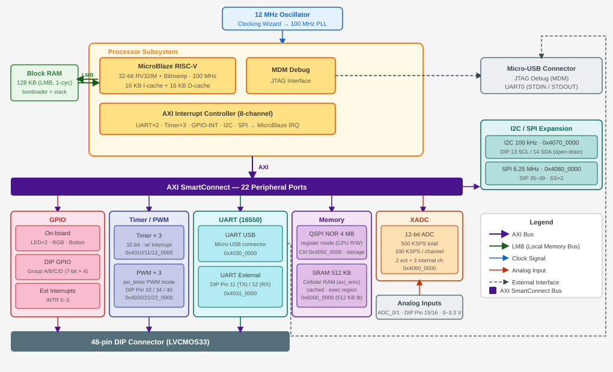

# RISC-V MCU on Cmod A7

Soft-core RISC-V MCU system on the Digilent Cmod A7-35T, used in the NCKU
"Microprocessor Principles and Applications" course. The FPGA design is
provided prebuilt, so students can treat the board as a normal microcontroller
and work purely at the firmware level.


## System overview

- CPU
  - MicroBlaze-V, RV32IM + Bitmanip, 100 MHz
  - 16 KB I-cache + 16 KB D-cache
- Memory
  - 128 KB block RAM — 32 KB bootloader + 32 KB ITCM + 64 KB DTCM
  - 512 KB SRAM — application code and data
  - 4 MB QSPI flash — bitstream and application storage
- Peripherals
  - GPIO: 28 pins in 4 groups, plus on-board LED / RGB / button
  - PWM: 3 channels
  - UART: 2 (USB and external)
  - I2C and SPI masters
  - XADC: 12-bit, 2 external channels
  - Timers: 3, with interrupts
  - Interrupt controller: 8 inputs



## Boot modes

### JTAG mode

For development: run over JTAG from Vitis (**Run/Debug**) — code goes to RAM,
the debugger works, and a power-cycle restores whatever is in flash. See the
[JTAG Debug Mode guide](docs/guides/JTAG-Debug-Mode/JTAG-Debug-Mode.md).

### Standalone boot

To keep a program on the board, deploy it into the QSPI flash — it then starts
automatically at every power-on. The bootloader is AMD/Xilinx's standard SREC
bootloader, embedded in the hardware image. Details are in the
[Standalone Boot Mode guide](docs/guides/Standalone-Boot-Mode/Standalone-Boot-Mode.md).

The same ELF works in both modes, and a new board only needs
`release/official_boot.mcs` programmed once with Vivado Hardware Manager
(guide, section 2).

## Repository layout

```
release/                  prebuilt outputs: official_boot.mcs, boot_srec.bit, top.bit, top_wrapper.xsa
RISC-V-MCU/               Vivado project (recreate_project.tcl)
board/                    Cmod A7 hardware: constraints, board files, KiCad symbol
docs/                     specs (pin / power / IP), guides (JTAG / standalone boot), diagrams
workspace-example/
  showcase/               full-feature demo: SPI+I2C to an ESP32, servo, ADC, interrupts (preloaded on the board)
  app_template/           template for new applications
tools/                    maintainer helper scripts (app scaffolding, JTAG run, flash deploy, doc builds)
```

## Rebuilding the hardware

Requires Vivado 2025.2:

```tcl
source RISC-V-MCU/recreate_project.tcl
```

After implementation, export the XSA and create a Vitis platform (standalone,
`microblaze_riscv_0`), or use the prebuilt `release/top_wrapper.xsa`.

## Other documents

- [Unified MCU datasheet](docs/datasheet/Cmod_A7_MCU_Datasheet.pdf) — every spec and guide below in one datasheet-style PDF
- [IP peripheral reference](docs/IP-Specification/Cmod_A7_IP_Peripheral_Reference.md) — peripheral capabilities, register base addresses, interrupt mapping
- [Pin specification](docs/Pin-Specification/Cmod_A7_Pin_Specification.md) — DIP pin assignments and electrical characteristics
- [Power specification](docs/Power-Specification/Cmod_A7_Power_Specification.md) — power rails and supply options
- [Vitis quick reference](docs/guides/README.md) — platform and application concepts, XSDB commands
- [Bus topology diagram](docs/images/dp_ip_topology.svg) — AXI masters, caches, and interconnect wiring

## License

Developed for educational use at National Cheng Kung University (NCKU).
