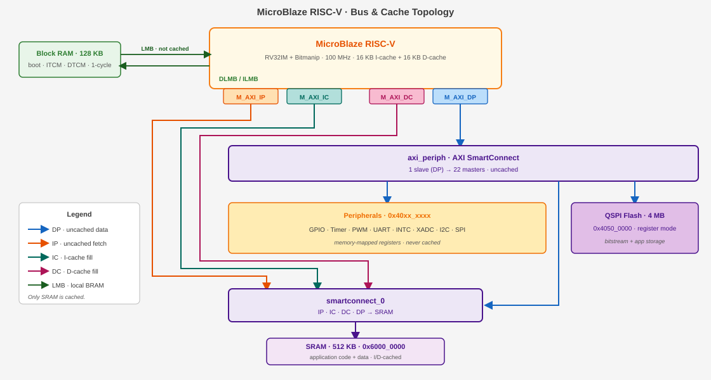

# Cmod A7-35T Internal IP Peripheral Reference

**Platform:** Xilinx Artix-7 (xc7a35tcpg236-1) — Cmod A7-35T  
**Processor:** MicroBlaze RISC-V  
**System Clock:** 100 MHz (12 MHz on-board oscillator × PLL)  
**Toolchain:** Vivado & Vitis 2025.2  

---

## 1. Processor Core & System Infrastructure

### 1.1 MicroBlaze RISC-V (`microblaze_riscv_0`)

| Item | Value |
|------|-------|
| Architecture | 32-bit RISC-V — RV32IM + bit-manipulation (hardware multiply/divide) |
| Clock | 100 MHz |
| Buses | LMB to local BRAM (1-cycle) · AXI to peripherals and external memory |
| Cache | 16 KB I-Cache + 16 KB D-Cache, write-through, 32 B lines — covers exactly the 512 KB SRAM (`0x6000_0000`–`0x6007_FFFF`) |
| Debug | JTAG: breakpoints, register inspection, memory read/write |

**Description:** The main processor core. Executes user firmware and reaches every peripheral through the AXI interconnect. Only the SRAM range is cached — BRAM is already single-cycle, and peripheral registers must never be cached.

### 1.2 Local Memory

| Item | Value |
|------|-------|
| Address | `0x0000_0000` – `0x0001_FFFF` (128 KB) |
| Access | 1 cycle, dual-port — instruction and data sides read simultaneously |
| Layout | 32 KB bootloader + 32 KB ITCM + 64 KB DTCM |

**Description:** Instruction and data local memory implemented with FPGA Block RAM — functionally this MCU's tightly-coupled memory (TCM): the ILMB/DLMB ports play the same role as ITCM/DTCM on other MCU cores (e.g. Cortex-M7), giving 1-cycle access outside the cache path. Layout: `0x0000`–`0x7FFF` (32 KB) holds the UART bootloader (restored from flash at every configuration); `0x8000`–`0xFFFF` (32 KB) is the application's ITCM for interrupt handlers and timing-critical code (`ITCM_FUNC`, copied out of the SRAM image by `mcu_init()` at startup); `0x10000`–`0x1FFFF` (64 KB) is the DTCM, holding the stack (top-down from `0x20000`) and `DTCM_DATA` fast data.

### 1.3 AXI SmartConnect (`microblaze_riscv_0_axi_periph`)

**Description:** AXI crossbar that fans the processor's data port out to all peripheral endpoints. Routing is pure address decoding — the diagram above shows which path each address range takes (a second, smaller interconnect merges the cache and debug masters in front of the SRAM controller).

### 1.4 AXI Interrupt Controller (`microblaze_riscv_0_axi_intc`)

| Item | Value |
|------|-------|
| Base Address | `0x4040_0000` |
| Interrupt Sources | 8 |

**Interrupt Mapping:**

| Channel | Source | Description |
|---------|--------|-------------|
| In0 | `timer_0` | System timer 0 interrupt |
| In1 | `timer_1` | System timer 1 interrupt |
| In2 | `timer_2` | System timer 2 interrupt |
| In3 | `uart_1` | External UART interrupt |
| In4 | `uart_USB` | USB UART interrupt |
| In5 | `INT_0_3` | External GPIO interrupt (4-bit) |
| In6 | `i2c_0` | I2C controller interrupt |
| In7 | `spi_0` | External SPI master interrupt |

### 1.5 Debug Module (`mdm_1`)

**Description:** MicroBlaze Debug Module providing JTAG debug access for breakpoints, register inspection, and memory read/write. It can also trigger a system reset from the debugger (used by `xsdb` / Vitis debug sessions).

### 1.6 Clocking Wizard (`clk_wiz_1`)

**Description:** Multiplies the 12 MHz on-board oscillator up to the 100 MHz system clock with an MMCM/PLL. Its `locked` signal indicates clock stability and gates the release of system reset.

### 1.7 Processor System Reset (`rst_clk_wiz_1_100M`)

**Description:** Generates synchronized reset signals for the CPU, bus fabric and peripherals, releasing them only after the clock is stable. External reset source: on-board button BTN0 (A18, active-high).

---

## 2. UART Communication

### 2.1 USB UART (`uart_USB`)

| Item | Value |
|------|-------|
| Base Address | `0x4030_0000` |
| TX / RX Pins | J18 / J17 — routed to the on-board Micro-USB connector |
| Interrupt | INTC In4 |

**Description:** 16550-compatible UART for host PC communication through the on-board Micro-USB connector. Baud rate is software-configured via the divisor latch: at 100 MHz system clock, divisor 54 (0x36) gives 115200 baud. Typically mapped as STDIN/STDOUT.

### 2.2 External UART (`uart_1`)

| Item | Value |
|------|-------|
| Base Address | `0x4031_0000` |
| TX / RX Pins | J1 (DIP 11) / K2 (DIP 12) |
| Interrupt | INTC In3 |

**Description:** Second 16550 UART exposed on the DIP connector for communication with external devices (e.g., sensor modules, Bluetooth modules).

---

## 3. GPIO (General Purpose I/O)

All GPIO groups are memory-mapped ports with per-bit direction control: the TRI register sets each pin's direction, the DATA register reads/writes the pin. Vitis driver: `XGpio`.

### 3.1 On-Board GPIO

| Instance | Base Address | Width | Direction | Connection | Description |
|----------|-------------|-------|-----------|------------|-------------|
| `board_led_2bits` | `0x4000_0000` | 2 | Output | A17, C16 | On-board LEDs × 2 |
| `board_button` | `0x4001_0000` | 1 | Input | B18 | On-board user button (BTN1) |
| `board_rgb` | `0x4002_0000` | 3 | Output | B17, B16, C17 | On-board RGB LED (R/G/B) |

### 3.2 DIP Connector GPIO (4 Groups × 7-bit)

| Instance | Base Address | Width | DIP Pins | Description |
|----------|-------------|-------|----------|-------------|
| `gpio_A_0_6` | `0x4003_0000` | 7 | Pin 1–7 | GPIO Group A, bidirectional I/O |
| `gpio_B_0_6` | `0x4004_0000` | 7 | Pin 17–23 | GPIO Group B, bidirectional I/O |
| `gpio_C_0_6` | `0x4005_0000` | 7 | Pin 42–48 | GPIO Group C, bidirectional I/O |
| `gpio_D_0_6` | `0x4006_0000` | 7 | Pin 26–32 | GPIO Group D, bidirectional I/O |

**Description:** Each group is a 7-bit bidirectional port; every bit can be an input or an output independently.

### 3.3 External Interrupt Inputs (`INT_0_3`)

| Item | Value |
|------|-------|
| Base Address | `0x4007_0000` |
| Width | 4-bit, input-only |
| DIP Pins | Pin 8 (INTR_0), Pin 9 (INTR_1), Pin 41 (INTR_2), Pin 33 (INTR_3) |
| Interrupt | INTC In5 |

**Description:** Four external interrupt inputs grouped into a single GPIO instance with interrupt generation enabled — a change on any of the four pins can raise INTC In5.

---

## 4. Timers & PWM

Six 32-bit AXI timer instances (Vitis driver: `XTmrCtr`) — three as general-purpose timers with interrupts, three with their outputs routed to pins as PWM channels.

### 4.1 System Timers

| Instance | Base Address | Interrupt | Description |
|----------|-------------|-----------|-------------|
| `timer_0` | `0x4010_0000` | INTC In0 | General-purpose system timer |
| `timer_1` | `0x4011_0000` | INTC In1 | General-purpose timer |
| `timer_2` | `0x4012_0000` | INTC In2 | General-purpose timer |

### 4.2 PWM Outputs

| Instance | Base Address | Output Pin | DIP Pin | Description |
|----------|-------------|-----------|---------|-------------|
| `PWM_0` | `0x4020_0000` | J3 | Pin 10 | PWM Channel 0 |
| `PWM_1` | `0x4021_0000` | W3 | Pin 34 | PWM Channel 1 |
| `PWM_2` | `0x4022_0000` | W4 | Pin 40 | PWM Channel 2 |

**Description:** Timer instances configured in PWM mode to generate square-wave outputs. Useful for LED dimming, motor speed control, buzzer tone generation, etc. Frequency and duty cycle are configured through the Timer Load Registers and the PWM enable bit.

---

## 5. External Memory

### 5.1 QSPI Flash (`axi_quad_spi_0`)

| Item | Value |
|------|-------|
| Base Address | `0x4050_0000` |
| Flash Device | On-board 4 MB QSPI NOR flash (Macronix; Micron on older boards) |
| Mode | CPU-programmable register mode — flash contents are **not** memory-mapped |
| FIFO | 256 B TX/RX — one full flash page (256 B) per transfer |

**Description:** Controls the on-board Quad-SPI NOR Flash. The full register set (control, status, TX/RX FIFO, slave select) is exposed at `0x4050_0000`, so the CPU can issue any SPI command — read (`0x0B`), Write Enable (`0x06`), Sector/Block Erase (`0x20`/`0xD8`), Page Program (`0x02`), status poll (`0x05`). This is what allows the UART bootloader to program application images into flash at runtime (`workspace-example/bootloader/src/bootloader.c` is a complete worked example, and the Vitis `XSpi` driver wraps the register protocol).

Flash contents are **not memory-mapped**: there is no XIP window, and code cannot execute from flash directly. The standalone-boot design instead copies the application from flash into SRAM at power-on (see the Standalone Boot Mode guide).

> **Design note:** a read-only memory-mapped XIP window and CPU-programmable register mode are
> mutually exclusive in this controller. This project chooses register mode: self-programming
> (Arduino-style `upload.py` workflow) was judged more valuable for the course than
> execute-in-place, and the 512 KB SRAM + I-cache serves execution instead.

### 5.2 SRAM / Cellular RAM (`axi_emc_0`)

| Item | Value |
|------|-------|
| Base Address | `0x6000_0000` |
| Size | 512 KB — `0x6000_0000` – `0x6007_FFFF`, an exact physical fit |
| Memory | On-board asynchronous SRAM (Cellular RAM) |
| Cache | Fully covered by the I-Cache and D-Cache |

**Description:** External memory controller for the on-board 512 KB SRAM — the main application memory: standalone boot copies the program here and executes it. Raw access latency is higher than Block RAM, but with both caches covering this range, hot code and data run near BRAM speed.

---

## 6. Analog-to-Digital Conversion (XADC)

### 6.1 XADC Wizard (`xadc_wiz_0`)

| Item | Value |
|------|-------|
| Base Address | `0x4060_0000` |
| Resolution | 12-bit |
| Conversion Rate | 500 KSPS aggregate |
| Sequencer | Continuous scan over the 5 enabled channels |

**Enabled Channels:**

| Channel | Source | Description |
|---------|--------|-------------|
| VAUX4 | DIP Pin 15 (G3/G2) | External analog input 0 (on-board divider: 0–3.3 V → 0–1 V) |
| VAUX12 | DIP Pin 16 (H2/J2) | External analog input 1 (on-board divider: 0–3.3 V → 0–1 V) |
| Temperature | Internal | FPGA die temperature monitor |
| VCCINT | Internal | Core voltage monitor (1.0 V) |
| VCCAUX | Internal | Auxiliary voltage monitor (1.8 V) |

**Description:** The Artix-7 built-in 12-bit ADC capable of measuring external analog signals and monitoring internal FPGA temperature and supply voltages. External input pins pass through an on-board resistive voltage divider (2.32 KΩ / 1 KΩ, ratio ≈ 0.301), accepting up to 3.3 V at the DIP pin.

**Effective Per-Channel Sampling Rate:** The sequencer continuously cycles through all 5 enabled channels (VAUX4, VAUX12, Temperature, VCCINT, VCCAUX). The aggregate conversion rate is 500 KSPS, giving each channel an effective rate of 500 K ÷ 5 = **100 KSPS**.

---

## 7. Serial Expansion Interfaces (I2C / SPI)

### 7.1 I2C Controller (`i2c_0`)

| Item | Value |
|------|-------|
| Base Address | `0x4070_0000` |
| SCL Frequency | 100 kHz (standard mode) |
| Input Glitch Filter | 50 ns on SCL and SDA — per the I2C tSP spike-suppression spec |
| SCL / SDA Pins | DIP Pin 13 (L1) / Pin 14 (L2) |
| Pull-ups | Weak FPGA internal pull-ups enabled; **external 4.7 kΩ to 3.3 V recommended** for real devices |
| Interrupt | INTC In6 |

**Description:** AXI IIC master for external I2C devices (sensors, EEPROMs, OLED displays). Open-drain signaling: any device may only pull the line low; the pull-up resistor returns it high. Devices are addressed by their 7-bit I2C address. Use the Vitis `XIic` driver.

### 7.2 External SPI Master (`spi_0`)

| Item | Value |
|------|-------|
| Base Address | `0x4080_0000` |
| SCLK | Software-programmable, ≈1.6 – 25 MHz (**6.25 MHz at reset**) |
| Clock Control | `0x4090_0000` — runtime clock setting; see `examples/07_spi_clock` for the `spi_set_clock()` helper |
| Slave Selects | 2 — two devices can share the bus |
| Pins | DIP 35 SCLK (V3) · 36 MOSI (W5) · 37 MISO (V4) · 38 SS0 (U4) · 39 SS1 (V5) |
| Interrupt | INTC In7 |

**Description:** SPI master for external devices (displays, ADCs, flash modules). Full-duplex push-pull signaling — no pull-ups needed; the active device is chosen by driving its SS line low. Use the Vitis `XSpi` driver. The serial clock is set at runtime through the clock-control block: slow it down for breadboard wiring or long cables, speed it up for short-wired display modules (`spi_set_clock(hz)` — one call, takes effect immediately).

> **Note:** This is a *second, independent* SPI controller — do not confuse it with
> `axi_quad_spi_0` (`0x4050_0000`), which is dedicated to the on-board QSPI boot flash.
> Firmware should select controllers by instance macro (`XPAR_SPI_0_BASEADDR` vs
> `XPAR_AXI_QUAD_SPI_0_BASEADDR`), never by generic `XPAR_XSPI_n_*` numbering.

---

## 8. Complete Address Map

Peripheral addresses follow a class-based convention — **`0x40[C]x_xxxx`, where `C` is the
peripheral class** (1 MB per class, 64 KB per instance). Reading an address immediately tells
you what kind of device it is: class 0 = GPIO, 1 = Timer, 2 = PWM, 3 = UART, 4 = INTC,
5 = QSPI control, 6 = XADC, 7 = I2C, 8 = SPI, 9 = SPI clock control.

| Base Address | Range | Peripheral | Type | Category |
|-----------------|-------|------------|---------|----------|
| `0x0000_0000` | 128K / 128K | Local Memory (BRAM) | BRAM | Memory |
| `0x4000_0000` | 64K | board_led_2bits | axi_gpio | GPIO |
| `0x4001_0000` | 64K | board_button | axi_gpio | GPIO |
| `0x4002_0000` | 64K | board_rgb | axi_gpio | GPIO |
| `0x4003_0000` | 64K | gpio_A_0_6 | axi_gpio | GPIO |
| `0x4004_0000` | 64K | gpio_B_0_6 | axi_gpio | GPIO |
| `0x4005_0000` | 64K | gpio_C_0_6 | axi_gpio | GPIO |
| `0x4006_0000` | 64K | gpio_D_0_6 | axi_gpio | GPIO |
| `0x4007_0000` | 64K | INT_0_3 | axi_gpio | Interrupt |
| `0x4010_0000` | 64K | timer_0 | axi_timer | Timer |
| `0x4011_0000` | 64K | timer_1 | axi_timer | Timer |
| `0x4012_0000` | 64K | timer_2 | axi_timer | Timer |
| `0x4020_0000` | 64K | PWM_0 | axi_timer | PWM |
| `0x4021_0000` | 64K | PWM_1 | axi_timer | PWM |
| `0x4022_0000` | 64K | PWM_2 | axi_timer | PWM |
| `0x4030_0000` | 64K | uart_USB | axi_uart16550 | Communication |
| `0x4031_0000` | 64K | uart_1 | axi_uart16550 | Communication |
| `0x4040_0000` | 64K | axi_intc | axi_intc | System |
| `0x4050_0000` | 64K | axi_quad_spi_0 (QSPI flash controller) | axi_quad_spi | Memory |
| `0x4060_0000` | 64K | xadc_wiz_0 | xadc_wiz | ADC |
| `0x4070_0000` | 64K | i2c_0 (DIP 13/14) | axi_iic | Communication |
| `0x4080_0000` | 64K | spi_0 (external master, DIP 35–39) | axi_quad_spi | Communication |
| `0x4090_0000` | 64K | spi_0_clk (SPI clock control) | clock control | Communication |
| `0x6000_0000` | 512K | axi_emc_0 (exact physical fit, I/D-cached) | axi_emc | Memory |

---
