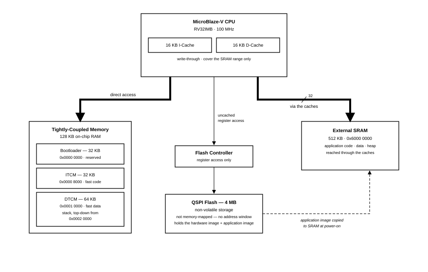
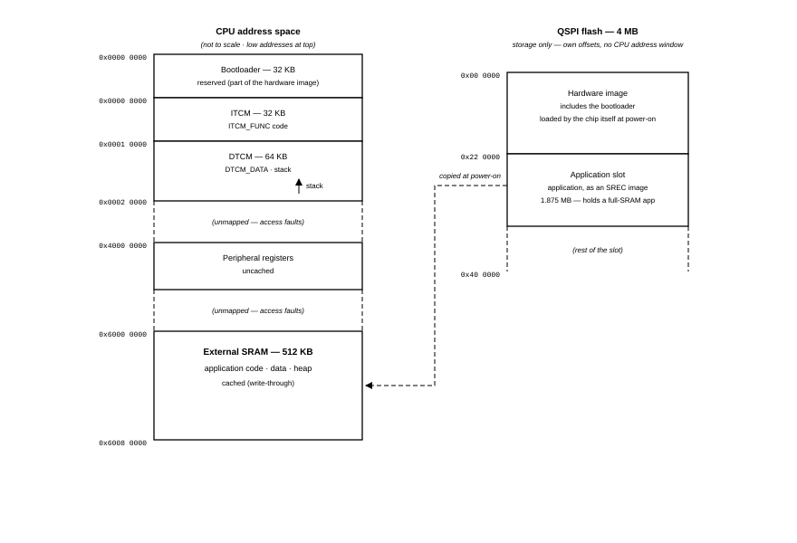

# Cmod A7-35T Memory Specification

**Platform:** Cmod A7-35T RISC-V MCU  
**Scope:** memory hierarchy, address map, caches, measured access latencies, placement guidance  

The MCU provides three types of memory: single-cycle tightly-coupled RAM,
cached external SRAM, and QSPI flash storage. Ordinary code and data reside
in the large SRAM; latency-critical code and data can be placed in memories
with fixed single-cycle timing.

---

## 1. Memory Hierarchy Overview

| Level | Memory | Size | Access | Role |
|---|---|---|---|---|
| 1 | ITCM + DTCM (tightly-coupled RAM) | 32 KB + 64 KB | 1 cycle, fixed | interrupt handlers, stack, hot data |
| 2 | I-Cache + D-Cache | 16 KB + 16 KB | adds ≈0 cycles on hit | transparent acceleration of SRAM |
| 3 | External SRAM | 512 KB | ≈26 cycles/word on miss | application code, data, heap |
| — | QSPI flash | 4 MB | not directly addressable | firmware storage, read at boot |

The tightly-coupled memories reside on a dedicated dual-port memory bus with
guaranteed single-cycle access; they are never cached because they are
already as fast as a cache hit. The external SRAM is the application's main
memory; it is reached through the caches, so frequently accessed code and
data run at tightly-coupled speed while the total space is 512 KB. The QSPI flash has no
CPU address window: firmware is stored in flash and executed from SRAM, and
the bootloader performs the copy at every power-on.

## 2. Memory Map

| Address range | Size | Region | Access |
|---|---|---|---|
| `0x0000_0000` – `0x0000_7FFF` | 32 KB | Bootloader (reserved) | 1 cycle |
| `0x0000_8000` – `0x0000_FFFF` | 32 KB | ITCM — application code (`ITCM_FUNC`) | 1 cycle |
| `0x0001_0000` – `0x0001_FFFF` | 64 KB | DTCM — data; stack grows down from `0x0002_0000` | 1 cycle |
| `0x4000_0000` – `0x40FF_FFFF` | — | Peripheral registers | uncached |
| `0x6000_0000` – `0x6007_FFFF` | 512 KB | External SRAM — application code / data / heap | cached |

Address decoding is exact: an access outside these ranges raises a bus error
instead of aliasing onto real memory, so an invalid pointer access is detected
rather than silently corrupting data. The QSPI flash does not appear in this map; it
is accessed only through the flash controller's registers.
Peripheral registers and base addresses are documented in the IP peripheral
reference.

## 3. Caches

| Item | Value |
|---|---|
| Instruction cache | 16 KB, 32-byte lines |
| Data cache | 16 KB, 32-byte lines |
| Write policy | write-through — every store is forwarded to SRAM |
| Cached range | exactly the SRAM: `0x6000_0000` – `0x6007_FFFF` |
| Software control | none — always on for the cached range |

Only the SRAM range is cached. The tightly-coupled memories are already
single-cycle, and peripheral registers must observe every access, so neither
is ever cached. No cache enable, disable, or flush operations are required in
normal application code.

The write-through policy has two practical consequences:

- Reads benefit fully from the cache: a hit has the same latency as a
  tightly-coupled RAM access.
- Writes always incur the SRAM latency, even on a cache hit. Frequently
  written data (counters, buffers filled in interrupt handlers) should
  therefore be placed in the DTCM.

## 4. Measured Access Latencies

Latencies were measured on the board at 100 MHz with an optimization-enabled
word-copy loop. Values are cycles per 32-bit word and include the loop's own
≈7-cycle overhead; the difference between rows is the memory's contribution.

| Access | Cycles/word | Notes |
|---|---|---|
| Tightly-coupled RAM read | ≈7.2 | equals the bare loop; the memory adds no cycles |
| SRAM read, cache **hit** | ≈7.2 | a hit is as fast as tightly-coupled RAM |
| SRAM read, cache **miss** | ≈26 | ≈151 cycles to fill one 32-byte line |
| SRAM write (write-through) | ≈23.6 | every store pays the SRAM latency |

> **Note:** Measure with compiler optimization enabled. An unoptimized build
> inflates the loop overhead to the point where cached and uncached accesses
> appear almost identical; the memory effects are hidden by the extra
> instructions.

## 5. Memory Placement Guidance

| What | Put it in | How (course template) |
|---|---|---|
| Interrupt handlers, timing-critical loops | ITCM | tag the function `ITCM_FUNC` |
| Frequently-written data, DMA-like buffers | DTCM | tag the variable `DTCM_DATA` |
| Stack | DTCM | placed there by the template's linker script |
| Everything else — code, constants, data, heap | SRAM | default |
| Firmware image | QSPI flash | written by the deployment step |

As a general rule, place code and data in SRAM by default and move them to
the TCMs when predictable timing is required. A function
in SRAM usually runs at cache speed, but its worst case (a cold cache line)
takes three to four times longer; for an interrupt handler this spread appears
directly as latency jitter. In the tightly-coupled memories the worst-case
latency equals the best-case latency.

At power-on the bootloader copies the application image from flash into SRAM
(see the Standalone Boot Mode guide); the template's `mcu_init()` then copies
`ITCM_FUNC` code out of the SRAM image into the ITCM and zeroes the DTCM.
The memory tour printed at boot lists each region's run-time addresses and
serves as a check that the layout is in effect.

> **Note:** `mcu_init();` must remain the first line of `main()`: contents
> placed in the tightly-coupled memories are not valid before it runs.
