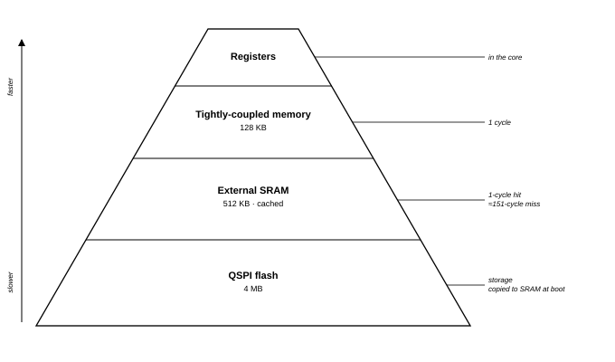

# Cmod A7-35T Memory Specification

**Platform:** Cmod A7-35T RISC-V MCU  
**Scope:** memory hierarchy, address map, caches, measured access latencies, placement guidance  

The MCU provides three types of memory: single-cycle tightly-coupled memory,
cached external SRAM, and QSPI flash storage. Ordinary code and data reside
in the SRAM; latency-critical code and data may be placed in the
tightly-coupled memory.

---

## 1. Memory Hierarchy Overview

| Level | Memory | Size | Role |
|---|---|---|---|
| 1 | ITCM + DTCM (tightly-coupled memory) | 32 KB + 64 KB | Interrupt handlers, stack, frequently accessed data |
| 2 | I-Cache + D-Cache | 16 KB + 16 KB | Transparent acceleration of SRAM |
| 3 | External SRAM | 512 KB | Application code, data, heap |
| — | QSPI flash | 4 MB | Non-volatile: application + hardware image |

## 2. Memory Map

| Address range | Size | Region | Access |
|---|---|---|---|
| `0x0000_0000` – `0x0000_7FFF` | 32 KB | Bootloader (reserved) | uncached |
| `0x0000_8000` – `0x0000_FFFF` | 32 KB | ITCM — application code | uncached |
| `0x0001_0000` – `0x0001_FFFF` | 64 KB | DTCM — data; stack grows down from `0x0002_0000` | uncached |
| `0x4000_0000` – `0x40FF_FFFF` | — | Peripheral registers | uncached |
| `0x6000_0000` – `0x6007_FFFF` | 512 KB | External SRAM — application code / data / heap | cached |

## 3. Caches

| Item | Value |
|---|---|
| Instruction cache | 16 KB, 32-byte lines |
| Data cache | 16 KB, 32-byte lines |
| Write policy | write-through — every store is forwarded to SRAM |
| Cached range | exactly the SRAM: `0x6000_0000` – `0x6007_FFFF` |

Only the SRAM range is cached. The tightly-coupled memories are already
fast enough, and peripheral registers must observe every access, so neither
is ever cached. The caches are always on for the cached range and require no
software management.

The write-through policy has two practical consequences:

- Reads benefit fully from the cache: a hit has the same latency as a
  TCM access.
- Writes always incur the SRAM latency, even on a cache hit. Frequently
  written data (counters, buffers filled in interrupt handlers) should
  therefore be placed in the DTCM.

## 4. Measured Access Latencies

The figures below were measured on the board at 100 MHz with an optimized
(`-O2`) word-copy loop and a hardware cycle counter; the cache-miss figure was
taken immediately after invalidating the data cache. Each value is the latency
of a single access.

| Access | Cycles | Notes |
|---|---|---|
| TCM read | 1 | single-cycle; identical every time |
| SRAM read, cache **hit** | 1 | a hit matches the TCM |
| SRAM read, cache **miss** | ≈151 | fetches one 32-byte line (≈19 cycles per word) |
| SRAM write (write-through) | ≈16 | per store; the store waits for SRAM |

## 5. Memory Placement Guidance

| What | Put it in |
|---|---|
| Interrupt handlers, timing-critical loops | ITCM |
| Frequently-written data, buffers | DTCM |
| Stack | DTCM |
| Everything else — code, constants, data, heap | SRAM |
| Firmware image | QSPI flash |

As a general rule, place code and data in SRAM by default and move them to
the TCMs when predictable timing is required.

A function in SRAM usually runs at cache speed, but its worst case (a cold
cache line) takes three to four times longer; for an interrupt handler this
spread appears directly as latency jitter.

In the tightly-coupled memories the worst-case latency equals the best-case
latency.
