# Cmod A7-35T Internal IP Peripheral Reference

**Platform:** Xilinx Artix-7 (xc7a35tcpg236-1) — Cmod A7-35T  
**Processor:** MicroBlaze RISC-V  
**System Clock:** 100 MHz (12 MHz on-board oscillator × PLL)  
**Toolchain:** Vivado & Vitis 2025.2  

---

## 1. Processor Core & System Infrastructure

### 1.1 MicroBlaze RISC-V (`microblaze_riscv_0`)

| Item | Value |
|------|-------|
| Architecture | 32-bit RISC-V, RV32IMB (hardware multiply/divide, bit-manipulation) |
| Clock | 100 MHz |
| Cache | 16 KB instruction + 16 KB data, write-through, 32-byte lines |
| Cached region | External SRAM only |
| Debug | JTAG: breakpoints, register and memory access |

**Description:** The processor executes firmware from SRAM. All memory and peripherals are memory-mapped into one address space. The external SRAM is cached; the tightly-coupled memory and peripheral registers are not, so peripheral reads and writes always take effect immediately.

### 1.2 Local Memory

| Item | Value |
|------|-------|
| Address | `0x0000_0000` – `0x0001_FFFF` (128 KB) |
| Ports | Dual-port: simultaneous instruction and data access |
| Layout | 32 KB bootloader + 32 KB ITCM + 64 KB DTCM |

**Description:** The tightly-coupled memory (TCM) is the on-chip RAM, accessed
outside the cache path. It is a dual-port memory, so an instruction fetch and a
data access can proceed at the same time. It serves the same role as ITCM/DTCM
on other MCU cores (e.g. Cortex-M7), and is divided into the bootloader region,
the ITCM for interrupt handlers and timing-critical code, and the DTCM for the
stack and fast data.

> **Note:** The bootloader region has no software load path. Its contents are
> carried inside the hardware image and restored from flash at every power-on,
> before the processor starts. Like a mask ROM, the bootloader survives
> application updates and cannot be corrupted by software
> (see the Standalone Boot Mode guide).

### 1.4 AXI Interrupt Controller (`microblaze_riscv_0_axi_intc`)

The interrupt controller combines the peripheral interrupt sources into a single
request line to the processor. When an interrupt is taken, the processor reads
the controller to determine which source is active.


**Interrupt Mapping:**

| Channel | Source | Description |
|---------|--------|-------------|
| In0 | `timer_0` | System timer 0 interrupt |
| In1 | `timer_1` | System timer 1 interrupt |
| In2 | `timer_2` | System timer 2 interrupt |
| In3 | `uart_1` | External UART interrupt |
| In4 | `uart_USB` | USB UART interrupt |
| In5 | `INT_0_3` | External GPIO interrupt (4-bit) |
| In6 | `i2c_0` | I2C controller interrupt |
| In7 | `spi_0` | External SPI master interrupt |

> **Note:** The controller's registers and programming interface are described
> with the other peripheral registers in the Peripherals chapter.

### 1.5 Debug Module (`mdm_1`)

**Description:** The debug module connects a host debugger to the processor
over the JTAG port. Vitis and `xsdb` sessions use it to halt and single-step
the core, set breakpoints, read and write the processor registers, memory, and
peripheral registers, and reset the system. Because every peripheral is
memory-mapped, the debugger can operate a device directly — for example
writing a GPIO register to drive an output — with no firmware running.


### 1.6 Clocking Wizard (`clk_wiz_1`)

**Description:** The system clock is 100 MHz, generated from the 12 MHz
on-board oscillator by an on-chip PLL. The processor and all peripherals
run at this frequency.

### 1.7 Processor System Reset (`rst_clk_wiz_1_100M`)

**Description:** A reset restarts the processor from the bootloader, which
reloads the application from flash (see the Standalone Boot Mode guide),
and returns peripheral registers to their reset values. There are three
reset sources: power-on, the on-board reset button BTN0, and a system
reset issued by the debugger.

---

## 2. UART Communication

### 2.1 USB UART (`uart_USB`)

| Item | Value |
|------|-------|
| Base Address | `0x4030_0000` |
| TX / RX Pins | J18 / J17 — routed to the on-board Micro-USB connector |
| Interrupt | INTC In4 |

**Description:** A 16550-compatible UART provides host PC communication through the on-board Micro-USB connector. The baud rate is software-configured via the divisor latch: at a 100 MHz system clock, divisor 54 (0x36) gives 115200 baud. This UART is typically mapped as STDIN/STDOUT.

### 2.2 External UART (`uart_1`)

| Item | Value |
|------|-------|
| Base Address | `0x4031_0000` |
| TX / RX Pins | J1 (DIP 11) / K2 (DIP 12) |
| Interrupt | INTC In3 |

**Description:** A second 16550 UART is exposed on the DIP connector for communication with external devices (e.g., sensor modules, Bluetooth modules).

### 2.3 UART Register Map

Both UARTs are 16550-compatible and share the same registers. The 16550
register bank begins at offset `0x1000` from the instance base address; the
Offset column below is measured from that base. Each register is one byte wide
in the 16550 and occupies the low 8 bits of a 32-bit bus word.

The registers at `0x1000` and `0x1004` are shared between two functions. When
the divisor-latch access bit `LCR.DLAB` is set they address the baud-rate
divisor (`DLL`, `DLM`); when it is clear they address the data and
interrupt-enable registers.

| Offset | Name | Access | Description |
|--------|------|--------|-------------|
| `0x1000` | `RBR` / `THR` / `DLL` | RO / WO / RW | Receive buffer (read) · transmit holding (write) · divisor LSB when `DLAB` = 1 |
| `0x1004` | `IER` / `DLM` | RW | Interrupt enable · divisor MSB when `DLAB` = 1 |
| `0x1008` | `IIR` / `FCR` | RO / WO | Interrupt identification (read) · FIFO control (write) |
| `0x100C` | `LCR` | RW | Line control: framing and `DLAB` |
| `0x1010` | `MCR` | RW | Modem control (no modem lines are wired on this device) |
| `0x1014` | `LSR` | RO | Line status |
| `0x1018` | `MSR` | RO | Modem status |
| `0x101C` | `SCR` | RW | Scratch register (general-purpose storage) |

#### LCR — Line Control Register (Offset 0x100C)

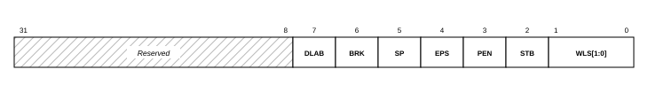

| Bits | Name | Access | Description |
|------|------|--------|-------------|
| 31:8 | — | — | Reserved. |
| 7 | `DLAB` | RW | Divisor latch access. Set to 1 to program `DLL`/`DLM`, then return to 0 to resume data access. |
| 6 | `BRK` | RW | Set break: hold the transmit line low. |
| 5 | `SP` | RW | Stick parity. |
| 4 | `EPS` | RW | Even parity select (1 = even, 0 = odd) when parity is enabled. |
| 3 | `PEN` | RW | Parity enable. |
| 2 | `STB` | RW | Stop bits: 0 = one stop bit, 1 = two stop bits. |
| 1:0 | `WLS` | RW | Word length: 00 = 5, 01 = 6, 10 = 7, 11 = 8 data bits. |

8N1 framing is `WLS` = 11, `STB` = 0, `PEN` = 0, giving `LCR` = `0x03`.

#### LSR — Line Status Register (Offset 0x1014)

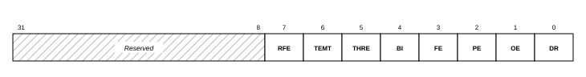

| Bits | Name | Access | Description |
|------|------|--------|-------------|
| 31:8 | — | — | Reserved. |
| 7 | `RFE` | RO | An errored byte is present in the receive FIFO. |
| 6 | `TEMT` | RO | Transmitter empty: both the holding register and the shift register are idle. |
| 5 | `THRE` | RO | Transmit holding register empty: ready to accept the next byte. |
| 4 | `BI` | RO | Break interrupt detected. |
| 3 | `FE` | RO | Framing error on the received byte. |
| 2 | `PE` | RO | Parity error on the received byte. |
| 1 | `OE` | RO | Overrun error: a received byte was lost. |
| 0 | `DR` | RO | Data ready: at least one received byte is available. |

#### IER — Interrupt Enable Register (Offset 0x1004, DLAB = 0)

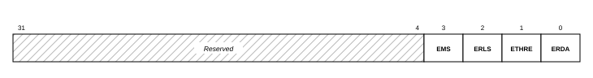

| Bits | Name | Access | Description |
|------|------|--------|-------------|
| 31:4 | — | — | Reserved. |
| 3 | `EMS` | RW | Enable the modem-status interrupt. |
| 2 | `ERLS` | RW | Enable the receiver line-status interrupt. |
| 1 | `ETHRE` | RW | Enable the transmitter-holding-empty interrupt. |
| 0 | `ERDA` | RW | Enable the received-data-available interrupt. |

#### FCR — FIFO Control Register (Offset 0x1008, write-only)

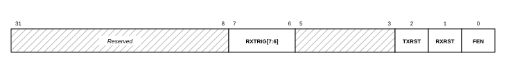

| Bits | Name | Access | Description |
|------|------|--------|-------------|
| 31:8 | — | — | Reserved. |
| 7:6 | `RXTRIG` | WO | Receive FIFO interrupt trigger level. |
| 5:3 | — | — | Reserved. |
| 2 | `TXRST` | WO | Reset (clear) the transmit FIFO. |
| 1 | `RXRST` | WO | Reset (clear) the receive FIFO. |
| 0 | `FEN` | WO | Enable the FIFOs. |

**Configuration recipe** (board-verified). Set 115200 8N1. At the 100 MHz
system clock the divisor is 100 MHz ÷ (16 × 115200) = 54:

```c
Xil_Out32(UART + 0x100C, 0x80);   /* LCR: DLAB = 1 (open divisor latch)     */
Xil_Out32(UART + 0x1000, 54);     /* DLL: divisor low  (0x36)               */
Xil_Out32(UART + 0x1004, 0);      /* DLM: divisor high                      */
Xil_Out32(UART + 0x100C, 0x03);   /* LCR: DLAB=0, 8 data, 1 stop, no parity */
Xil_Out32(UART + 0x1008, 0x07);   /* FCR: enable and reset both FIFOs       */
```

Polled transmit and receive:

```c
while (!(Xil_In32(UART + 0x1014) & 0x20)) ;  /* wait for THRE (LSR bit 5)  */
Xil_Out32(UART + 0x1000, c);                 /* THR: transmit one byte     */

if (Xil_In32(UART + 0x1014) & 0x01)          /* DR (LSR bit 0): byte ready */
    c = Xil_In32(UART + 0x1000);             /* RBR: the read pops the FIFO */
```

> **Note:** `DLAB` must be returned to 0 after the divisor is loaded, or
> accesses at `0x1000` and `0x1004` continue to address the divisor latch
> instead of the data and interrupt-enable registers. The divisor value 54
> applies at the 100 MHz system clock; a different clock changes it
> (divisor = clock ÷ (16 × baud)).

> **Reference:** AMD AXI UART 16550 LogiCORE IP Product Guide ([PG143](https://docs.amd.com/r/en-US/pg143-axi-uart16550)).

---

## 3. GPIO (General Purpose I/O)

The general-purpose GPIO ports carry polled digital I/O. Each port is
memory-mapped with per-pin direction control: the `TRI` register sets each
pin's direction and the `DATA` register reads or writes the pins. These ports
have no interrupt hardware and cannot raise a processor interrupt; to watch a
signal by interrupt, use the External Interrupt Inputs described in the next
section.

### 3.1 DIP Connector GPIO (4 Groups × 7-bit)

| Instance | Base Address | Width | DIP Pins | Description |
|----------|-------------|-------|----------|-------------|
| `gpio_A_0_6` | `0x4003_0000` | 7 | Pin 1–7 | GPIO Group A, bidirectional I/O |
| `gpio_B_0_6` | `0x4004_0000` | 7 | Pin 17–23 | GPIO Group B, bidirectional I/O |
| `gpio_C_0_6` | `0x4005_0000` | 7 | Pin 42–48 | GPIO Group C, bidirectional I/O |
| `gpio_D_0_6` | `0x4006_0000` | 7 | Pin 26–32 | GPIO Group D, bidirectional I/O |

**Description:** Each group is a 7-bit bidirectional port; every bit can be an input or an output independently.

### 3.2 GPIO Register Map

Every general-purpose port has the same two registers. Offsets are relative to
the port base address. Only the low WIDTH bits are implemented (7 for groups
A–D; the on-board ports below are narrower); unimplemented bits read as 0.

| Offset | Name | Access | Reset | Description |
|--------|------|--------|-------|-------------|
| `0x000` | `DATA` | RW | `0x0` | Port data |
| `0x004` | `TRI` | RW | all 1 | Per-pin direction (1 = input, 0 = output) |

#### DATA — Port Data Register (Offset 0x000)

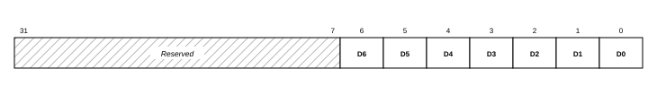

| Bits | Name | Access | Description |
|------|------|--------|-------------|
| 31:W | — | — | Reserved (W = port width). Read as 0. |
| W-1:0 | `DATA` | RW | One bit per pin. A read returns the pin level for input pins and the last written value for output pins. A write drives pins configured as outputs; writes to input pins have no effect. |

#### TRI — Port Direction Register (Offset 0x004)

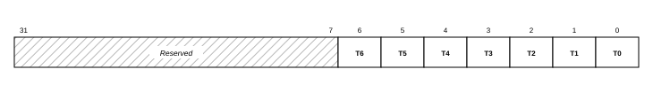

| Bits | Name | Access | Description |
|------|------|--------|-------------|
| 31:W | — | — | Reserved. Read as 0. |
| W-1:0 | `TRI` | RW | Per-pin direction: 1 = input, 0 = output. All pins are inputs after reset; software must clear the relevant bits before driving a pin. On the fixed-direction ports (LEDs, RGB, button) the direction is set in hardware and this register has no effect. |

> **Note:** Setting or clearing individual pins is a read-modify-write of
> `DATA` (read the port, change the bits, write it back); it is not atomic, so
> if an interrupt handler also writes the same port, keep all writes to that
> port in one context.

### 3.3 On-Board GPIO

| Instance | Base Address | Width | Direction | Connection | Description |
|----------|-------------|-------|-----------|------------|-------------|
| `board_led_2bits` | `0x4000_0000` | 2 | Output | LD1, LD2 | On-board LEDs × 2 |
| `board_button` | `0x4001_0000` | 1 | Input | BTN1 | On-board user button |
| `board_rgb` | `0x4002_0000` | 3 | Output | LD0 | On-board RGB LED (bit 0 = Blue, bit 1 = Green, bit 2 = Red) |

The on-board ports use the same two registers, but each has a fixed direction:
the LED and RGB ports are outputs and the button is an input, so the `TRI`
register is hardwired (0 = output, 1 = input) and software cannot change it.
The `DATA` and `TRI` layout of each port follows.

**On-board LEDs (`board_led_2bits`)** — 2-bit output, base `0x4000_0000`.

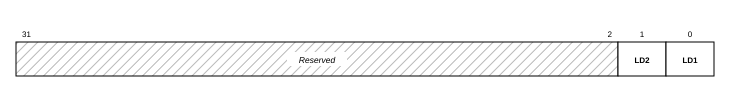

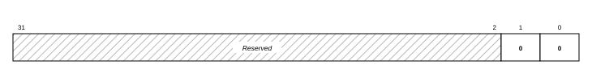

**User button (`board_button`)** — 1-bit input, base `0x4001_0000`.


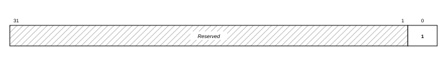

**RGB LED (`board_rgb`, LD0)** — 3-bit output, base `0x4002_0000`.

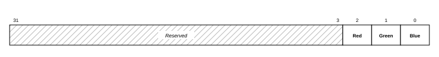

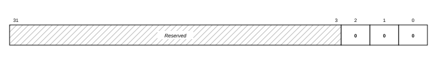

> **Reference:** AMD AXI GPIO LogiCORE IP Product Guide ([PG144](https://docs.amd.com/r/en-US/pg144-axi-gpio)).

---

## External Interrupt Inputs (`INT_0_3`)

`INT_0_3` is a dedicated interrupt port: it is the only GPIO instance built with
interrupt hardware. Its four pins are input-only, and a change on any of them
(either edge) sets the interrupt status and raises interrupt controller input 5.
The four pins share one interrupt line, so the handler reads `DATA` to see which
pin changed. The pins can also be polled through `DATA` without using
interrupts.

| Item | Value |
|------|-------|
| Base Address | `0x4007_0000` |
| Width | 4-bit, input-only |
| DIP Pins | Pin 8 (INTR_0), Pin 9 (INTR_1), Pin 41 (INTR_2), Pin 33 (INTR_3) |
| Interrupt | Interrupt controller input 5 |

### Interrupt Register Map

Offsets are relative to the base address. `DATA` reads the four pins; the three
interrupt registers gate and report the shared interrupt.

| Offset | Name | Access | Reset | Description |
|--------|------|--------|-------|-------------|
| `0x000` | `DATA` | RO | `0x0` | Pin levels (bits 3:0) |
| `0x004` | `TRI` | RO | all 1 | Direction, fixed to input |
| `0x11C` | `GIER` | RW | `0x0` | Global interrupt enable |
| `0x120` | `ISR` | R/TOW | `0x0` | Interrupt status |
| `0x128` | `IER` | RW | `0x0` | Interrupt enable |

#### DATA — Pin Data Register (Offset 0x000)

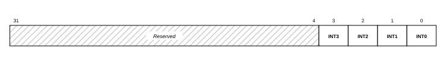

| Bits | Name | Access | Description |
|------|------|--------|-------------|
| 31:4 | — | — | Reserved. |
| 3:0 | `INT3`–`INT0` | RO | Live level of the four interrupt pins. The handler reads this to see which pin changed. |

#### GIER — Global Interrupt Enable Register (Offset 0x11C)

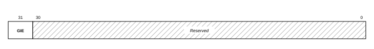

| Bits | Name | Access | Description |
|------|------|--------|-------------|
| 31 | `GIE` | RW | Master gate for the port's interrupt output. Write `0x8000_0000` to enable. |
| 30:0 | — | — | Reserved. |

#### ISR and IER — Interrupt Status and Enable (Offsets 0x120 / 0x128)

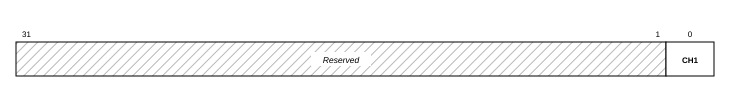

| Register | Bit 0 — `CH1` |
|----------|---------------|
| `ISR` (status, `0x120`, R/TOW) | Set by hardware when any of the four pins changes. Toggle-on-write: to clear, read the register and write the read value back. |
| `IER` (enable, `0x128`, RW) | Enables the port interrupt. Any of the four pins raises the same interrupt; the handler reads `DATA` to determine which line changed. |

The port has a single interrupt channel (`CH1`, bit 0) shared by all four pins;
`ISR` reports it and `IER` enables it. Bits 31:1 are reserved in both.

> **Note:** `ISR` toggles on write: writing a hard-coded 1 while the bit is
> clear sets a phantom pending interrupt, so always write back exactly the value
> just read. The interrupt reaches the processor through the interrupt
> controller as input 5.

> **Reference:** The external interrupt inputs are the AMD AXI GPIO core in interrupt mode; see its LogiCORE IP Product Guide ([PG144](https://docs.amd.com/r/en-US/pg144-axi-gpio)).

---

## 4. Timers & PWM

The device provides six 32-bit timer instances: three serve as general-purpose timers with interrupts, and three have their outputs routed to pins as PWM channels.

### 4.1 System Timers

| Instance | Base Address | Interrupt | Description |
|----------|-------------|-----------|-------------|
| `timer_0` | `0x4010_0000` | INTC In0 | General-purpose system timer |
| `timer_1` | `0x4011_0000` | INTC In1 | General-purpose timer |
| `timer_2` | `0x4012_0000` | INTC In2 | General-purpose timer |

### 4.2 PWM Outputs

| Instance | Base Address | Output Pin | DIP Pin | Description |
|----------|-------------|-----------|---------|-------------|
| `PWM_0` | `0x4020_0000` | J3 | Pin 10 | PWM Channel 0 |
| `PWM_1` | `0x4021_0000` | W3 | Pin 34 | PWM Channel 1 |
| `PWM_2` | `0x4022_0000` | W4 | Pin 40 | PWM Channel 2 |

**Description:** These timer instances are configured in PWM mode to generate square-wave outputs, suitable for applications such as LED dimming, motor speed control, and buzzer tone generation. Frequency and duty cycle are configured through the Timer Load Registers and the PWM enable bit.

### 4.3 Timer/PWM Register Map

Each of the six instances (`timer_0`–`timer_2`, `PWM_0`–`PWM_2`) is one dual
32-bit counter block: counter 0 occupies offsets `0x00`–`0x08` and counter 1
the same layout at `+0x10`. The general-purpose timers normally use counter 0
alone; PWM mode uses both counters together (period and high time). All
counters run at the 100 MHz bus clock, so one count equals 10 ns.

| Offset | Name | Access | Reset | Description |
|--------|------|--------|-------|-------------|
| `0x00` | `TCSR0` | RW | `0x0` | Counter 0 control and status |
| `0x04` | `TLR0` | RW | `0x0` | Counter 0 load value |
| `0x08` | `TCR0` | RO | `0x0` | Counter 0 current count |
| `0x10` | `TCSR1` | RW | `0x0` | Counter 1 control and status |
| `0x14` | `TLR1` | RW | `0x0` | Counter 1 load value |
| `0x18` | `TCR1` | RO | `0x0` | Counter 1 current count |

#### TCSR — Control and Status Register (Offsets 0x00 and 0x10)

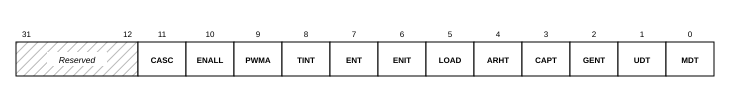

| Bits | Name | Access | Description |
|------|------|--------|-------------|
| 31:12 | — | — | Reserved. Write 0. |
| 11 | `CASC` | RW | Cascade both counters into one 64-bit counter. |
| 10 | `ENALL` | RW | Writing 1 enables both counters simultaneously. |
| 9 | `PWMA` | RW | PWM mode (set in both TCSRs, together with `GENT`). |
| 8 | `TINT` | R/W1C | Interrupt status: reads 1 after the counter reaches its terminal value. Write the register back with this bit set to clear it. |
| 7 | `ENT` | RW | Enable the counter (starts counting). |
| 6 | `ENIT` | RW | Enable the interrupt output (general-purpose timers only). |
| 5 | `LOAD` | RW | While 1, forces `TCR` = `TLR`. Write a pulse (set, then clear) to load; the counter does not run while set. |
| 4 | `ARHT` | RW | Auto-reload: reload `TLR` and continue at the terminal value (1) or stop and hold (0). |
| 3 | `CAPT` | RW | External capture mode. Not wired in this device; write 0. |
| 2 | `GENT` | RW | Enable the generate output (required for PWM). |
| 1 | `UDT` | RW | Count direction: 0 = up, 1 = down. |
| 0 | `MDT` | RW | Mode: 0 = generate, 1 = capture. Write 0. |

#### TLR — Load Register (Offsets 0x04 and 0x14)

The 32-bit value loaded into the counter by `LOAD` or by auto-reload. In PWM
mode `TLR0` sets the period and `TLR1` the high time; the hardware adds a
fixed two-cycle overhead to each interval.

#### TCR — Counter Register (Offsets 0x08 and 0x18)

The live 32-bit count, readable at any time without disturbing the counter.

**Configuration recipes** (board-verified, from the course examples):

Free-running cycle counter — count up from zero and read elapsed 10 ns
cycles:

```c
Xil_Out32(TIMER + 0x00, 0x0);          /* TCSR0: stop, clear mode  */
Xil_Out32(TIMER + 0x04, 0x0);          /* TLR0: start value 0      */
Xil_Out32(TIMER + 0x00, 0x20);         /* LOAD pulse: TCR0 <- TLR0 */
Xil_Out32(TIMER + 0x00, 0x80);         /* ENT: run                 */
u32 cycles = Xil_In32(TIMER + 0x08);   /* TCR0: elapsed cycles     */
```

PWM output — `TLR0` = period, `TLR1` = high time, both counters in
PWM-generate mode (`0x296` = `PWMA|T-run|ARHT|GENT|UDT`):

```c
Xil_Out32(PWM + 0x04, PERIOD_CYC);     /* TLR0: period             */
Xil_Out32(PWM + 0x00, 0x20);           /* LOAD counter 0           */
Xil_Out32(PWM + 0x14, HIGH_CYC);       /* TLR1: high time          */
Xil_Out32(PWM + 0x10, 0x20);           /* LOAD counter 1           */
Xil_Out32(PWM + 0x00, 0x296);          /* TCSR0: PWMA|ENT|ARHT|GENT|UDT */
Xil_Out32(PWM + 0x10, 0x296);          /* TCSR1: same              */
```

> **Note:** The PWM instances are ordinary timer blocks whose outputs are
> routed to pins — there are no separate PWM registers. In interrupt use,
> the handler must clear `TINT` by writing `TCSR` back with bit 8 set;
> an unacknowledged timer interrupt re-enters the handler forever. A program
> loaded over JTAG on top of a running program can inherit an already-armed
> timer interrupt, so interrupt-driven programs should disable and
> acknowledge the timers during initialization before enabling their own
> handlers.

> **Reference:** AMD AXI Timer LogiCORE IP Product Guide ([PG079](https://docs.amd.com/r/en-US/pg079-axi-timer)).

---

## 5. External Memory

### 5.1 QSPI Flash (`axi_quad_spi_0`)

| Item | Value |
|------|-------|
| Base Address | `0x4050_0000` |
| Flash Device | 4 MB QSPI NOR flash: Macronix MX25L3273F, or Micron N25Q032A on older boards |
| Mode | CPU-programmable register mode — flash contents are not memory-mapped |
| FIFO | 256 B TX/RX — one full flash page (256 B) per transfer |

**Description:** This controller manages the on-board Quad-SPI NOR Flash. The CPU drives the flash through the controller, so firmware can read, erase, and program it at runtime.

Flash contents are not memory-mapped: there is no XIP window, and code cannot execute from flash directly. The standalone-boot design instead copies the application from flash into SRAM at power-on (see the Standalone Boot Mode guide).

> **Design note:** A read-only memory-mapped XIP window and CPU-programmable register mode are
> mutually exclusive in this controller. This MCU uses register mode: keeping the
> flash CPU-programmable at runtime is preferred over execute-in-place, and
> execution is served by the 512 KB SRAM and the I-cache instead.

### 5.2 SRAM / Cellular RAM (`axi_emc_0`)

| Item | Value |
|------|-------|
| Base Address | `0x6000_0000` |
| Size | 512 KB — `0x6000_0000` – `0x6007_FFFF` |
| Memory | On-board asynchronous SRAM |
| Cache | Covered by the I-Cache and D-Cache |

**Description:** This memory controller interfaces to the on-board 512 KB SRAM, the main application memory: standalone boot copies the program here and executes it.

---

## 6. Analog-to-Digital Conversion (XADC)

### 6.1 XADC Wizard (`xadc_wiz_0`)

| Item | Value |
|------|-------|
| Base Address | `0x4060_0000` |
| Resolution | 12-bit |
| Conversion Rate | 500 KSPS aggregate |
| Sequencer | Continuous scan over the 5 enabled channels |

**Enabled Channels:**

| Channel | Source | Description |
|---------|--------|-------------|
| VAUX4 | DIP Pin 15 (G3/G2) | External analog input 0 (on-board divider: 0–3.3 V → 0–1 V) |
| VAUX12 | DIP Pin 16 (H2/J2) | External analog input 1 (on-board divider: 0–3.3 V → 0–1 V) |
| Temperature | Internal | FPGA die temperature monitor |
| VCCINT | Internal | Core voltage monitor (1.0 V) |
| VCCAUX | Internal | Auxiliary voltage monitor (1.8 V) |

**Description:** The Artix-7 built-in 12-bit ADC measures external analog signals and monitors internal FPGA temperature and supply voltages. External input pins pass through an on-board resistive voltage divider (2.32 kΩ / 1 kΩ, ratio ≈ 0.301), accepting up to 3.3 V at the DIP pin.

**Effective Per-Channel Sampling Rate:** The sequencer continuously cycles through all 5 enabled channels (VAUX4, VAUX12, Temperature, VCCINT, VCCAUX). The aggregate conversion rate is 500 KSPS, giving each channel an effective rate of 500 K ÷ 5 = 100 KSPS.

#### XADC Register Map

The registers below are the status register and the per-channel result
registers. Offsets are from the instance base (`0x4060_0000`).

| Offset | Name | Access | Description |
|--------|------|--------|-------------|
| `0x000` | `SRR` | WO | Software reset. Write `0x0000000A`. |
| `0x004` | `SR` | RO | Status: conversion busy, end-of-conversion, end-of-sequence. |
| `0x200` | `TEMP` | RO | Die-temperature result |
| `0x204` | `VCCINT` | RO | Core-supply result |
| `0x208` | `VCCAUX` | RO | Auxiliary-supply result |
| `0x250` | `VAUX4` | RO | External analog input 0 (DIP pin 15) |
| `0x270` | `VAUX12` | RO | External analog input 1 (DIP pin 16) |

##### SR — Status Register (Offset 0x004)

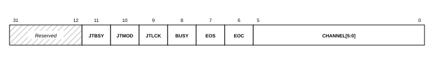

| Bits | Name | Access | Description |
|------|------|--------|-------------|
| 31:12 | — | — | Reserved. |
| 11 | `JTBSY` | RO | Configuration-port access busy. |
| 10 | `JTMOD` | RO | A configuration-port write has occurred. |
| 9 | `JTLCK` | RO | Configuration-port access is locked. |
| 8 | `BUSY` | RO | A conversion is in progress. |
| 7 | `EOS` | RO | End of sequence: the sequencer finished one pass over the channels. |
| 6 | `EOC` | RO | End of conversion: a new sample is ready. |
| 5:0 | `CHANNEL` | RO | Number of the channel just converted. |

##### Conversion Data Format

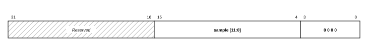

Each result register returns a 12-bit sample left-justified in bits 15:4 of the
low half-word; bits 3:0 read 0. Shift the register right by 4 to obtain the
12-bit value. An external input passes through the on-board divider (ratio
≈ 0.301), so the voltage at the DIP pin is approximately
`(sample ÷ 4096) × 3.32 V` (full scale ≈ 3.3 V).

> **Note:** The sequencer scans the five enabled channels continuously, so each
> result register always holds the most recent sample and no start-conversion
> step is required. A result read returns the left-justified 16-bit word; shift
> right by 4 for the 12-bit value.

> **Reference:** AMD XADC Wizard LogiCORE IP Product Guide ([PG091](https://docs.amd.com/v/u/en-US/pg091-xadc-wiz)).

---

## 7. Serial Expansion Interfaces (I2C / SPI)

### 7.1 I2C Controller (`i2c_0`)

| Item | Value |
|------|-------|
| Base Address | `0x4070_0000` |
| SCL Frequency | 100 kHz (standard mode) |
| Input Glitch Filter | 50 ns on SCL and SDA — per the I2C tSP spike-suppression spec |
| SCL / SDA Pins | DIP Pin 13 (L1) / Pin 14 (L2) |
| Pull-ups | Weak FPGA internal pull-ups enabled; external 4.7 kΩ to 3.3 V recommended for real devices |
| Interrupt | INTC In6 |

**Description:** An I2C master controls external I2C devices (sensors, EEPROMs, OLED displays). The bus uses open-drain signaling: any device may only pull the line low, and the pull-up resistor returns it high. Devices are addressed by their 7-bit I2C address.

#### I2C Register Map

The registers below cover control, status, the FIFOs, the target address, and
the software reset. Offsets are from the instance base (`0x4070_0000`).

| Offset | Name | Access | Description |
|--------|------|--------|-------------|
| `0x1C` | `GIE` | RW | Global interrupt enable |
| `0x20` | `ISR` | R/TOW | Interrupt status |
| `0x28` | `IER` | RW | Interrupt enable |
| `0x40` | `SOFTR` | WO | Software reset. Write `0x0000000A`. |
| `0x100` | `CR` | RW | Control |
| `0x104` | `SR` | RO | Status |
| `0x108` | `TX_FIFO` | WO | Transmit FIFO |
| `0x10C` | `RX_FIFO` | RO | Receive FIFO (a read pops one entry) |
| `0x110` | `ADR` | RW | Target slave address |

##### CR — Control Register (Offset 0x100)

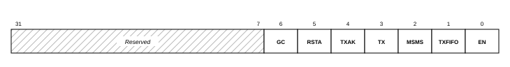

| Bits | Name | Access | Description |
|------|------|--------|-------------|
| 31:7 | — | — | Reserved. |
| 6 | `GC` | RW | General-call enable (respond to the I2C general-call address). |
| 5 | `RSTA` | RW | Repeated start. |
| 4 | `TXAK` | RW | Transmit acknowledge: the level driven on ACK while receiving (1 = NACK). |
| 3 | `TX` | RW | Direction: 1 = transmit, 0 = receive. |
| 2 | `MSMS` | RW | Master mode: setting it issues a START and begins a master transfer; clearing it issues STOP. |
| 1 | `TXFIFO` | RW | Reset (clear) the transmit FIFO. |
| 0 | `EN` | RW | Enable the controller. |

##### SR — Status Register (Offset 0x104)

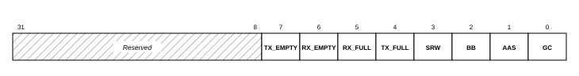

| Bits | Name | Access | Description |
|------|------|--------|-------------|
| 31:8 | — | — | Reserved. |
| 7 | `TX_EMPTY` | RO | Transmit FIFO empty. |
| 6 | `RX_EMPTY` | RO | Receive FIFO empty. |
| 5 | `RX_FULL` | RO | Receive FIFO full. |
| 4 | `TX_FULL` | RO | Transmit FIFO full. |
| 3 | `SRW` | RO | Slave read/write direction (when addressed as a slave). |
| 2 | `BB` | RO | Bus busy. Check this is clear before starting a transfer. |
| 1 | `AAS` | RO | Addressed as slave. |
| 0 | `GC` | RO | General call received. |

> **Note:** A slave that never acknowledges (unpowered or mis-wired) can wedge
> the bus. Before starting a transfer, reset the controller by writing
> `0x0000000A` to `SOFTR` and confirm `SR.BB` (bit 2) is clear.

> **Reference:** AMD AXI IIC Bus Interface LogiCORE IP Product Guide ([PG090](https://docs.amd.com/r/en-US/pg090-axi-iic)).

### 7.2 External SPI Master (`spi_0`)

| Item | Value |
|------|-------|
| Base Address | `0x4080_0000` |
| SCLK | Software-programmable, ≈1.6 – 25 MHz (6.25 MHz at reset) |
| Clock Control | `0x4090_0000` — runtime serial-clock setting (see the Serial Clock Control Unit below) |
| Slave Selects | 2 — two devices can share the bus |
| Pins | DIP 35 SCLK (V3) · 36 MOSI (W5) · 37 MISO (V4) · 38 SS0 (U4) · 39 SS1 (V5) |
| Interrupt | INTC In7 |

**Description:** An SPI master controls external devices (displays, ADCs, flash modules). The interface uses full-duplex push-pull signaling and requires no pull-up resistors; the active device is selected by driving its SS line low. The serial clock is set at runtime through the clock-control block: select a lower rate for breadboard wiring or long cables, and a higher rate for short-wired display modules.

> **Note:** This is a second, independent SPI controller. Do not confuse it with
> the QSPI flash controller at `0x4050_0000`, which is dedicated to the on-board
> boot flash; the two are addressed by their distinct base addresses.

#### SPI Register Map

Offsets are from the instance base (`0x4080_0000`). The registers below are the
subset used for byte-level transfers.

| Offset | Name | Access | Description |
|--------|------|--------|-------------|
| `0x1C` | `DGIER` | RW | Global interrupt enable |
| `0x20` | `ISR` | R/TOW | Interrupt status |
| `0x28` | `IER` | RW | Interrupt enable |
| `0x40` | `SRR` | WO | Software reset. Write `0x0000000A` to reset the core. |
| `0x60` | `CR` | RW | Control |
| `0x64` | `SR` | RO | Status |
| `0x68` | `DTR` | WO | Transmit data FIFO |
| `0x6C` | `DRR` | RO | Receive data FIFO (a read pops one entry) |
| `0x70` | `SSR` | RW | Slave select, active-low (one bit per slave) |
| `0x74` | `TFO` | RO | Transmit FIFO occupancy |
| `0x78` | `RFO` | RO | Receive FIFO occupancy |

##### CR — Control Register (Offset 0x60)

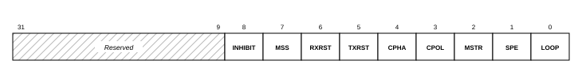

| Bits | Name | Access | Description |
|------|------|--------|-------------|
| 31:9 | — | — | Reserved. |
| 8 | `INHIBIT` | RW | Master transaction inhibit: set to hold off the transfer while the FIFO is loaded, clear to start. |
| 7 | `MSS` | RW | Manual slave-select mode: software drives `SSR`. Required for framed transactions. |
| 6 | `RXRST` | RW | Reset (clear) the receive FIFO. |
| 5 | `TXRST` | RW | Reset (clear) the transmit FIFO. |
| 4 | `CPHA` | RW | Clock phase. |
| 3 | `CPOL` | RW | Clock polarity. |
| 2 | `MSTR` | RW | Master mode (always set on this device). |
| 1 | `SPE` | RW | SPI system enable. |
| 0 | `LOOP` | RW | Internal loopback (transmit tied to receive) for self-test. |

##### SR — Status Register (Offset 0x64)

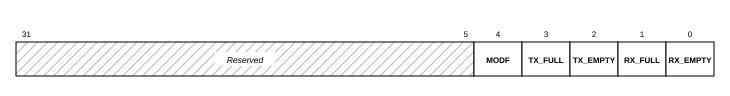

| Bits | Name | Access | Description |
|------|------|--------|-------------|
| 31:5 | — | — | Reserved. |
| 4 | `MODF` | RO | Mode fault. |
| 3 | `TX_FULL` | RO | Transmit FIFO full. |
| 2 | `TX_EMPTY` | RO | Transmit FIFO empty. |
| 1 | `RX_FULL` | RO | Receive FIFO full. |
| 0 | `RX_EMPTY` | RO | Receive FIFO empty. Poll this to detect a received byte. |

**Byte transfer** (board-verified). The control register is written in two
steps — a setup value that resets the FIFOs, then a run value that does not —
and the slave is framed by `SSR`:

```c
Xil_Out32(SPI + 0x40, 0x0A);         /* SRR: reset the core                    */
Xil_Out32(SPI + 0x60, 0x1E6);        /* CR setup: enable, master, manual SS,   */
                                     /*           reset both FIFOs             */
/* settle ~10 us (about a dozen serial-clock periods) before the next write   */
Xil_Out32(SPI + 0x60, 0x086);        /* CR run: external transfer, SS via SSR  */
Xil_Out32(SPI + 0x70, ~(1u << n));   /* SSR: assert slave n (active-low)       */
Xil_Out32(SPI + 0x68, tx_byte);      /* DTR: queue a byte (<= 15 in flight)    */
while (Xil_In32(SPI + 0x64) & 0x01) ; /* SR.RX_EMPTY: wait for the reply       */
rx = Xil_In32(SPI + 0x6C);           /* DRR: the read pops the received byte   */
Xil_Out32(SPI + 0x70, 0xFFFFFFFF);   /* SSR: deassert all slaves               */
```

#### Serial Clock Control Unit

The serial clock is produced by a separate clock unit at `0x4090_0000`, which
feeds the SPI core its bit clock. The rate is `SCK = 200 MHz ÷ N` with `N` from
8 to 128, giving roughly 1.6 to 25 MHz (6.25 MHz at reset, `N` = 32). Program it
directly, then wait for the lock bit:

| Offset | Name | Access | Description |
|--------|------|--------|-------------|
| `0x200` | `CFG0` | RW | Multiplier setting. Write `0x0801` (fixed for this device). |
| `0x208` | `CFG1` | RW | Divider `N`: `SCK = 200 MHz ÷ N`. |
| `0x25C` | `APPLY` | WO | Write `3` to apply the new setting. |
| `0x004` | `STATUS` | RO | Bit 0 = clock locked. |

```c
Xil_Out32(SPICLK + 0x200, 0x0801);         /* multiplier (fixed)              */
Xil_Out32(SPICLK + 0x208, N);              /* SCK = 200 MHz / N, N = 8..128   */
Xil_Out32(SPICLK + 0x25C, 3);              /* apply                           */
while (!(Xil_In32(SPICLK + 0x004) & 1)) ;  /* wait for lock                   */
```

> **Note:** This SPI core clocks the bus asynchronously to the CPU. Reliable
> register-level transfers follow three rules: after a software
> reset or a FIFO-reset write, wait about a dozen serial-clock periods before
> the next register write; keep no more than 15 bytes in flight, because the
> FIFO holds 16 and `TX_FULL` lags; and detect received bytes by the
> `SR.RX_EMPTY` level, never by the occupancy counters, which lag in both
> directions.

> **Reference:** AMD AXI Quad SPI LogiCORE IP Product Guide ([PG153](https://docs.amd.com/r/en-US/pg153-axi-quad-spi)).

---

## 8. Interrupt Controller (`microblaze_riscv_0_axi_intc`)

The interrupt controller and its source-to-input map are introduced in the
System Architecture chapter, with the block diagram. This section documents its
registers. Offsets are from the instance base (`0x4040_0000`). The status,
enable, pending, and acknowledge registers all use the same layout: bit `n`
corresponds to interrupt input `n`.

### Interrupt Controller Register Map

| Offset | Name | Access | Description |
|--------|------|--------|-------------|
| `0x00` | `ISR` | RW | Interrupt status (raw, one bit per input) |
| `0x04` | `IPR` | RO | Pending = status AND enable |
| `0x08` | `IER` | RW | Interrupt enable (one bit per input) |
| `0x0C` | `IAR` | WO | Acknowledge: write 1 to a bit to clear that handled interrupt |
| `0x10` | `SIE` | WO | Set individual enable bits |
| `0x14` | `CIE` | WO | Clear individual enable bits |
| `0x18` | `IVR` | RO | Number of the lowest pending input |
| `0x1C` | `MER` | RW | Master enable |

#### IER — Interrupt Enable Register (Offset 0x08)

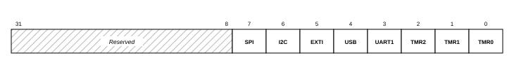

Each bit enables one source; the bit position is the input number (bit 0 =
Timer 0 … bit 7 = SPI). `ISR`, `IPR`, and `IAR` share this bit-per-input
layout. Bits 31:8 are reserved.

#### MER — Master Enable Register (Offset 0x1C)

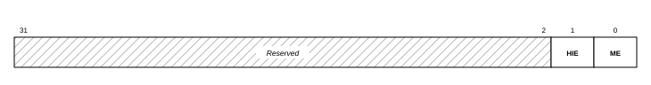

| Bits | Name | Access | Description |
|------|------|--------|-------------|
| 31:2 | — | — | Reserved. |
| 1 | `HIE` | RW | Hardware interrupt enable (write-once). |
| 0 | `ME` | RW | Master enable: gates all interrupt output to the processor. |

> **Note:** Enabling an interrupt takes two gates: the per-source bit in `IER`
> and the master enable `MER.ME`. When loading a new program over JTAG, clear
> `MER` and `IER` first — an interrupt left pending by the previous program is
> taken as soon as the master enable is set, before the new handlers are
> installed.

> **Reference:** AMD AXI Interrupt Controller LogiCORE IP Product Guide ([PG099](https://docs.amd.com/v/u/en-US/pg099-axi-intc)).

---

## 9. Complete Address Map

Peripheral addresses follow a class-based convention: `0x40[C]x_xxxx`, where `C` is the
peripheral class (1 MB per class, 64 KB per instance). The device type is identifiable
directly from the address: class 0 = GPIO, 1 = Timer, 2 = PWM, 3 = UART, 4 = INTC,
5 = QSPI control, 6 = XADC, 7 = I2C, 8 = SPI, 9 = SPI clock control.

| Base Address | Range | Peripheral | Category |
|-----------------|-------|------------|----------|
| `0x0000_0000` | 128K | Tightly-coupled memory (bootloader, ITCM, DTCM) | Memory |
| `0x4000_0000` | 64K | On-board LEDs | GPIO |
| `0x4001_0000` | 64K | User button (BTN1) | GPIO |
| `0x4002_0000` | 64K | RGB LED | GPIO |
| `0x4003_0000` | 64K | GPIO group A | GPIO |
| `0x4004_0000` | 64K | GPIO group B | GPIO |
| `0x4005_0000` | 64K | GPIO group C | GPIO |
| `0x4006_0000` | 64K | GPIO group D | GPIO |
| `0x4007_0000` | 64K | External interrupt inputs | Interrupt |
| `0x4010_0000` | 64K | Timer 0 | Timer |
| `0x4011_0000` | 64K | Timer 1 | Timer |
| `0x4012_0000` | 64K | Timer 2 | Timer |
| `0x4020_0000` | 64K | PWM 0 | PWM |
| `0x4021_0000` | 64K | PWM 1 | PWM |
| `0x4022_0000` | 64K | PWM 2 | PWM |
| `0x4030_0000` | 64K | USB UART | Communication |
| `0x4031_0000` | 64K | External UART (DIP 11/12) | Communication |
| `0x4040_0000` | 64K | Interrupt controller | System |
| `0x4050_0000` | 64K | QSPI flash controller | Memory |
| `0x4060_0000` | 64K | ADC (XADC) | ADC |
| `0x4070_0000` | 64K | I2C controller (DIP 13/14) | Communication |
| `0x4080_0000` | 64K | SPI master (DIP 35–39) | Communication |
| `0x4090_0000` | 64K | SPI clock control | Communication |
| `0x6000_0000` | 512K | External SRAM (cached) | Memory |

---

## 9. Register Access Conventions

Every peripheral register in this device is a 32-bit word at a word-aligned
offset from its instance base address (the Complete Address Map lists all
base addresses). Registers must be accessed with full-word reads and writes:
in C through `Xil_In32`/`Xil_Out32` or a `volatile` pointer, in assembly with
`lw`/`sw`. Byte and halfword accesses are not supported by the peripheral
bus.

The register tables in this chapter use the following access codes:

| Code | Meaning |
|------|---------|
| RW | Read/write |
| RO | Read-only; writes are ignored |
| WO | Write-only; reads return undefined data |
| R/W1C | Readable; writing 1 to a set bit clears it |
| R/TOW | Readable; writing 1 toggles the bit (see the GPIO `ISR`) |
| RSE | Read side effect: the read itself changes state (for example, a UART receive-buffer read pops the FIFO) |

Reserved bits read as undefined values and must be written as 0. Reading a
register with a read side effect purely for inspection (for example from a
debugger memory view) consumes data or clears status.

Reset values apply after power-on or reset.

> **Note:** Loading a new program over JTAG does not reset the peripherals:
> registers keep whatever state the previous program left, including armed
> interrupts and half-finished bus transactions. Programs must not assume
> reset values at entry; initialize every peripheral before use.

The following two fragments are equivalent and drive the RGB LED port
directly — the C form is the course template's idiom, the assembly form is
the `asm_template` idiom:

```c
Xil_Out32(0x40020000 + 0x4, 0x0);   /* TRI: all pins outputs */
Xil_Out32(0x40020000, 0x2);         /* DATA: green (bit 1)   */
```

```asm
li   t0, 0x40020000        # RGB LED port base
sw   zero, 4(t0)           # TRI: all pins outputs
li   t1, 0x2               # bit 1 = green
sw   t1, 0(t0)             # DATA: drive the pins
```

---
