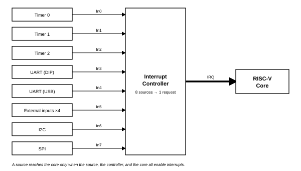
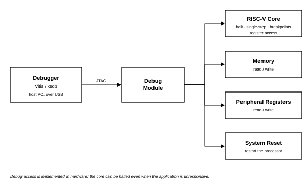

# Cmod A7-35T Internal IP Peripheral Reference

**Platform:** Xilinx Artix-7 (xc7a35tcpg236-1) — Cmod A7-35T  
**Processor:** MicroBlaze RISC-V  
**System Clock:** 100 MHz (12 MHz on-board oscillator × PLL)  
**Toolchain:** Vivado & Vitis 2025.2  

---

## 1. Processor Core & System Infrastructure

### 1.1 MicroBlaze RISC-V (`microblaze_riscv_0`)

| Item | Value |
|------|-------|
| Architecture | 32-bit RISC-V, RV32IMB (hardware multiply/divide, bit-manipulation) |
| Clock | 100 MHz |
| Cache | 16 KB instruction + 16 KB data, write-through, 32-byte lines |
| Cached region | External SRAM only |
| Debug | JTAG: breakpoints, register and memory access |

**Description:** The processor executes firmware from SRAM. All memory and peripherals are memory-mapped into one address space. The external SRAM is cached; on-chip RAM and peripheral registers are not, so peripheral reads and writes always take effect immediately.

### 1.2 Local Memory

| Item | Value |
|------|-------|
| Address | `0x0000_0000` – `0x0001_FFFF` (128 KB) |
| Access | 1 cycle, dual-port — instruction and data sides read simultaneously |
| Layout | 32 KB bootloader + 32 KB ITCM + 64 KB DTCM |

**Description:** Instruction and data local memory is implemented with FPGA Block RAM and functions as this MCU's tightly-coupled memory (TCM): the separate instruction and data local-memory ports serve the same role as ITCM/DTCM on other MCU cores (e.g. Cortex-M7), giving 1-cycle access outside the cache path. The layout is as follows: `0x0000`–`0x7FFF` (32 KB) holds the bootloader (restored from flash at every configuration); `0x8000`–`0xFFFF` (32 KB) is the application's ITCM for interrupt handlers and timing-critical code (`ITCM_FUNC`, copied out of the SRAM image by `mcu_init()` at startup); `0x10000`–`0x1FFFF` (64 KB) is the DTCM, holding the stack (top-down from `0x20000`) and `DTCM_DATA` fast data.

### 1.4 AXI Interrupt Controller (`microblaze_riscv_0_axi_intc`)

The interrupt controller combines the peripheral interrupt sources into a single
request line to the processor. When an interrupt is taken, the processor reads
the controller to determine which source is active.



**Interrupt Mapping:**

| Channel | Source | Description |
|---------|--------|-------------|
| In0 | `timer_0` | System timer 0 interrupt |
| In1 | `timer_1` | System timer 1 interrupt |
| In2 | `timer_2` | System timer 2 interrupt |
| In3 | `uart_1` | External UART interrupt |
| In4 | `uart_USB` | USB UART interrupt |
| In5 | `INT_0_3` | External GPIO interrupt (4-bit) |
| In6 | `i2c_0` | I2C controller interrupt |
| In7 | `spi_0` | External SPI master interrupt |

### 1.5 Debug Module (`mdm_1`)

**Description:** The debug module connects a host debugger to the processor
over the JTAG port. Vitis and `xsdb` sessions use it to halt and single-step
the core, set breakpoints, read and write the processor registers, memory, and
peripheral registers, and reset the system. Because every peripheral is
memory-mapped, the debugger can operate a device directly — for example
writing a GPIO register to drive an output — with no firmware running.



### 1.6 Clocking Wizard (`clk_wiz_1`)

**Description:** The system clock is 100 MHz, generated from the 12 MHz
on-board oscillator by an on-chip PLL. The processor and all peripherals
run at this frequency.

### 1.7 Processor System Reset (`rst_clk_wiz_1_100M`)

**Description:** A reset restarts the processor from the bootloader, which
reloads the application from flash (see the Standalone Boot Mode guide),
and returns peripheral registers to their reset values. There are three
reset sources: power-on, the on-board reset button BTN0, and a system
reset issued by the debugger.

---

## 2. UART Communication

### 2.1 USB UART (`uart_USB`)

| Item | Value |
|------|-------|
| Base Address | `0x4030_0000` |
| TX / RX Pins | J18 / J17 — routed to the on-board Micro-USB connector |
| Interrupt | INTC In4 |

**Description:** A 16550-compatible UART provides host PC communication through the on-board Micro-USB connector. The baud rate is software-configured via the divisor latch: at a 100 MHz system clock, divisor 54 (0x36) gives 115200 baud. This UART is typically mapped as STDIN/STDOUT.

### 2.2 External UART (`uart_1`)

| Item | Value |
|------|-------|
| Base Address | `0x4031_0000` |
| TX / RX Pins | J1 (DIP 11) / K2 (DIP 12) |
| Interrupt | INTC In3 |

**Description:** A second 16550 UART is exposed on the DIP connector for communication with external devices (e.g., sensor modules, Bluetooth modules).

---

## 3. GPIO (General Purpose I/O)

All GPIO groups are memory-mapped ports with per-bit direction control: the TRI register sets each pin's direction, and the DATA register reads or writes the pin. The Vitis driver is `XGpio`.

### 3.1 On-Board GPIO

| Instance | Base Address | Width | Direction | Connection | Description |
|----------|-------------|-------|-----------|------------|-------------|
| `board_led_2bits` | `0x4000_0000` | 2 | Output | LD1, LD2 | On-board LEDs × 2 |
| `board_button` | `0x4001_0000` | 1 | Input | BTN1 | On-board user button |
| `board_rgb` | `0x4002_0000` | 3 | Output | LD0 | On-board RGB LED (bit 0 = Blue, bit 1 = Green, bit 2 = Red) |

### 3.2 DIP Connector GPIO (4 Groups × 7-bit)

| Instance | Base Address | Width | DIP Pins | Description |
|----------|-------------|-------|----------|-------------|
| `gpio_A_0_6` | `0x4003_0000` | 7 | Pin 1–7 | GPIO Group A, bidirectional I/O |
| `gpio_B_0_6` | `0x4004_0000` | 7 | Pin 17–23 | GPIO Group B, bidirectional I/O |
| `gpio_C_0_6` | `0x4005_0000` | 7 | Pin 42–48 | GPIO Group C, bidirectional I/O |
| `gpio_D_0_6` | `0x4006_0000` | 7 | Pin 26–32 | GPIO Group D, bidirectional I/O |

**Description:** Each group is a 7-bit bidirectional port; every bit can be an input or an output independently.

### 3.3 External Interrupt Inputs (`INT_0_3`)

| Item | Value |
|------|-------|
| Base Address | `0x4007_0000` |
| Width | 4-bit, input-only |
| DIP Pins | Pin 8 (INTR_0), Pin 9 (INTR_1), Pin 41 (INTR_2), Pin 33 (INTR_3) |
| Interrupt | INTC In5 |

**Description:** Four external interrupt inputs are grouped into a single GPIO instance with interrupt generation enabled. A change on any of the four pins can raise INTC In5.

### 3.4 GPIO Register Map

All eight GPIO ports share the same register layout. Offsets are relative to
the port base address listed in the tables above. Only the low WIDTH bits of
each register are implemented (7 for groups A–D, 4 for `INT_0_3`, 3 for the
RGB port, 2 for the LED port, 1 for the button port); unimplemented bits read
as 0. Offsets `0x08`/`0x0C` (second-channel data and direction) are not
implemented in this device, and the interrupt registers (`0x11C`–`0x128`) are
implemented on the `INT_0_3` port only.

| Offset | Name | Access | Reset | Description |
|--------|------|--------|-------|-------------|
| `0x000` | `DATA` | RW | `0x0` | Port data |
| `0x004` | `TRI` | RW | all 1 | Per-pin direction (1 = input, 0 = output) |
| `0x11C` | `GIER` | RW | `0x0` | Global interrupt enable (`INT_0_3` only) |
| `0x120` | `ISR` | R/TOW | `0x0` | Interrupt status (`INT_0_3` only) |
| `0x128` | `IER` | RW | `0x0` | Interrupt enable (`INT_0_3` only) |

#### DATA — Port Data Register (Offset 0x000)

| Bits | Name | Access | Description |
|------|------|--------|-------------|
| 31:W | — | — | Reserved (W = port width). Read as 0. |
| W-1:0 | `DATA` | RW | One bit per pin. A read returns the pin level for input pins and the last written value for output pins. A write drives pins configured as outputs; writes to input pins have no effect. |

#### TRI — Port Direction Register (Offset 0x004)

| Bits | Name | Access | Description |
|------|------|--------|-------------|
| 31:W | — | — | Reserved. Read as 0. |
| W-1:0 | `TRI` | RW | Per-pin direction: 1 = input, 0 = output. All pins are inputs after reset; software must clear the relevant bits before driving a pin. On the fixed-direction ports (LEDs, RGB, button, `INT_0_3`) the direction is set in hardware and this register has no effect. |

#### GIER — Global Interrupt Enable Register (Offset 0x11C)

| Bits | Name | Access | Description |
|------|------|--------|-------------|
| 31 | `GIE` | RW | Master gate for the port's interrupt output. Write `0x8000_0000` to enable. |
| 30:0 | — | — | Reserved. |

#### ISR — Interrupt Status Register (Offset 0x120)

| Bits | Name | Access | Description |
|------|------|--------|-------------|
| 31:1 | — | — | Reserved. |
| 0 | `CH1` | R/TOW | Set by hardware when any input pin of the port changes state (either edge). Toggle-on-write: to clear, read the register and write the read value back. |

#### IER — Interrupt Enable Register (Offset 0x128)

| Bits | Name | Access | Description |
|------|------|--------|-------------|
| 31:1 | — | — | Reserved. |
| 0 | `CH1` | RW | Enables the port interrupt. The enable is per port, not per pin: any of the four `INT_0_3` inputs raises the same interrupt, and the handler reads `DATA` to determine which line changed. |

**Driver support (`XGpio`).** The functions below cover the course use of the
driver; the last column names the registers each one accesses.

| Function | Purpose | Registers touched |
|----------|---------|-------------------|
| `XGpio_Initialize(&inst, base)` | Bind the instance to a port | none |
| `XGpio_SetDataDirection(&inst, 1, m)` | Set pin directions | `TRI` |
| `XGpio_DiscreteRead(&inst, 1)` | Read pin states | `DATA` |
| `XGpio_DiscreteWrite(&inst, 1, v)` | Write the whole port | `DATA` |
| `XGpio_DiscreteSet/Clear(&inst, 1, m)` | Set or clear only masked bits | `DATA` (read-modify-write) |
| `XGpio_InterruptEnable(&inst, 1)` | Enable the port interrupt | `IER` |
| `XGpio_InterruptGlobalEnable(&inst)` | Open the interrupt gate | `GIER` |
| `XGpio_InterruptGetStatus(&inst)` | Read pending status | `ISR` |
| `XGpio_InterruptClear(&inst, 1)` | Acknowledge the interrupt | `ISR` (toggle-safe) |

> **Note:** Three behaviors are board-verified sources of bugs. `ISR` toggles
> on write: writing a hard-coded 1 while the bit is clear sets a phantom
> pending interrupt, so always write back exactly the value just read (or use
> `XGpio_InterruptClear`). `XGpio_DiscreteSet`/`Clear` are read-modify-write
> sequences, not atomic: if an interrupt handler writes the same port, keep
> all writes to that port in one context. Finally, `XGpio_Initialize` in this
> toolchain takes the port base address (`XPAR_..._BASEADDR`); older examples
> that pass a device ID do not compile here.

---

## 4. Timers & PWM

The device provides six 32-bit timer instances (Vitis driver: `XTmrCtr`): three serve as general-purpose timers with interrupts, and three have their outputs routed to pins as PWM channels.

### 4.1 System Timers

| Instance | Base Address | Interrupt | Description |
|----------|-------------|-----------|-------------|
| `timer_0` | `0x4010_0000` | INTC In0 | General-purpose system timer |
| `timer_1` | `0x4011_0000` | INTC In1 | General-purpose timer |
| `timer_2` | `0x4012_0000` | INTC In2 | General-purpose timer |

### 4.2 PWM Outputs

| Instance | Base Address | Output Pin | DIP Pin | Description |
|----------|-------------|-----------|---------|-------------|
| `PWM_0` | `0x4020_0000` | J3 | Pin 10 | PWM Channel 0 |
| `PWM_1` | `0x4021_0000` | W3 | Pin 34 | PWM Channel 1 |
| `PWM_2` | `0x4022_0000` | W4 | Pin 40 | PWM Channel 2 |

**Description:** These timer instances are configured in PWM mode to generate square-wave outputs, suitable for applications such as LED dimming, motor speed control, and buzzer tone generation. Frequency and duty cycle are configured through the Timer Load Registers and the PWM enable bit.

### 4.3 Timer/PWM Register Map

Each of the six instances (`timer_0`–`timer_2`, `PWM_0`–`PWM_2`) is one dual
32-bit counter block: counter 0 occupies offsets `0x00`–`0x08` and counter 1
the same layout at `+0x10`. The general-purpose timers normally use counter 0
alone; PWM mode uses both counters together (period and high time). All
counters run at the 100 MHz bus clock, so one count equals 10 ns.

| Offset | Name | Access | Reset | Description |
|--------|------|--------|-------|-------------|
| `0x00` | `TCSR0` | RW | `0x0` | Counter 0 control and status |
| `0x04` | `TLR0` | RW | `0x0` | Counter 0 load value |
| `0x08` | `TCR0` | RO | `0x0` | Counter 0 current count |
| `0x10` | `TCSR1` | RW | `0x0` | Counter 1 control and status |
| `0x14` | `TLR1` | RW | `0x0` | Counter 1 load value |
| `0x18` | `TCR1` | RO | `0x0` | Counter 1 current count |

#### TCSR — Control and Status Register (Offsets 0x00 and 0x10)

| Bits | Name | Access | Description |
|------|------|--------|-------------|
| 31:12 | — | — | Reserved. Write 0. |
| 11 | `CASC` | RW | Cascade both counters into one 64-bit counter. |
| 10 | `ENALL` | RW | Writing 1 enables both counters simultaneously. |
| 9 | `PWMA` | RW | PWM mode (set in both TCSRs, together with `GENT`). |
| 8 | `TINT` | R/W1C | Interrupt status: reads 1 after the counter reaches its terminal value. Write the register back with this bit set to clear it. |
| 7 | `ENT` | RW | Enable the counter (starts counting). |
| 6 | `ENIT` | RW | Enable the interrupt output (general-purpose timers only). |
| 5 | `LOAD` | RW | While 1, forces `TCR` = `TLR`. Write a pulse (set, then clear) to load; the counter does not run while set. |
| 4 | `ARHT` | RW | Auto-reload: reload `TLR` and continue at the terminal value (1) or stop and hold (0). |
| 3 | `CAPT` | RW | External capture mode. Not wired in this device; write 0. |
| 2 | `GENT` | RW | Enable the generate output (required for PWM). |
| 1 | `UDT` | RW | Count direction: 0 = up, 1 = down. |
| 0 | `MDT` | RW | Mode: 0 = generate, 1 = capture. Write 0. |

#### TLR — Load Register (Offsets 0x04 and 0x14)

The 32-bit value loaded into the counter by `LOAD` or by auto-reload. In PWM
mode `TLR0` sets the period and `TLR1` the high time; the hardware adds a
fixed two-cycle overhead to each interval.

#### TCR — Counter Register (Offsets 0x08 and 0x18)

The live 32-bit count, readable at any time without disturbing the counter.

**Configuration recipes** (board-verified, from the course examples):

Free-running cycle counter — count up from zero and read elapsed 10 ns
cycles:

```c
Xil_Out32(TIMER + 0x00, 0x0);          /* TCSR0: stop, clear mode  */
Xil_Out32(TIMER + 0x04, 0x0);          /* TLR0: start value 0      */
Xil_Out32(TIMER + 0x00, 0x20);         /* LOAD pulse: TCR0 <- TLR0 */
Xil_Out32(TIMER + 0x00, 0x80);         /* ENT: run                 */
u32 cycles = Xil_In32(TIMER + 0x08);   /* TCR0: elapsed cycles     */
```

PWM output — `TLR0` = period, `TLR1` = high time, both counters in
PWM-generate mode (`0x296` = `PWMA|T-run|ARHT|GENT|UDT`):

```c
Xil_Out32(PWM + 0x04, PERIOD_CYC);     /* TLR0: period             */
Xil_Out32(PWM + 0x00, 0x20);           /* LOAD counter 0           */
Xil_Out32(PWM + 0x14, HIGH_CYC);       /* TLR1: high time          */
Xil_Out32(PWM + 0x10, 0x20);           /* LOAD counter 1           */
Xil_Out32(PWM + 0x00, 0x296);          /* TCSR0: PWMA|ENT|ARHT|GENT|UDT */
Xil_Out32(PWM + 0x10, 0x296);          /* TCSR1: same              */
```

**Driver support (`XTmrCtr`).**

| Function | Purpose | Registers touched |
|----------|---------|-------------------|
| `XTmrCtr_Initialize(&inst, base)` | Bind the instance and stop both counters | `TCSR0/1` |
| `XTmrCtr_SetOptions(&inst, n, opt)` | Set mode bits (down-count, auto-reload, interrupt) | `TCSR` |
| `XTmrCtr_SetResetValue(&inst, n, v)` | Set the load value | `TLR` |
| `XTmrCtr_Start(&inst, n)` | Load and start counter *n* | `TCSR` (`LOAD`, then `ENT`) |
| `XTmrCtr_Stop(&inst, n)` | Stop counter *n* | `TCSR` |
| `XTmrCtr_GetValue(&inst, n)` | Read the live count | `TCR` |

> **Note:** The PWM instances are ordinary timer blocks whose outputs are
> routed to pins — there are no separate PWM registers. In interrupt use,
> the handler must clear `TINT` by writing `TCSR` back with bit 8 set;
> an unacknowledged timer interrupt re-enters the handler forever. A program
> loaded over JTAG on top of a running program can inherit an already-armed
> timer interrupt, so interrupt-driven programs should disable and
> acknowledge the timers during initialization before enabling their own
> handlers.

---

## 5. External Memory

### 5.1 QSPI Flash (`axi_quad_spi_0`)

| Item | Value |
|------|-------|
| Base Address | `0x4050_0000` |
| Flash Device | On-board 4 MB QSPI NOR flash (Macronix; Micron on older boards) |
| Mode | CPU-programmable register mode — flash contents are not memory-mapped |
| FIFO | 256 B TX/RX — one full flash page (256 B) per transfer |

**Description:** This controller manages the on-board Quad-SPI NOR Flash. The full register set (control, status, TX/RX FIFO, slave select) is exposed at `0x4050_0000`, so the CPU can issue any SPI command: read (`0x0B`), Write Enable (`0x06`), Sector/Block Erase (`0x20`/`0xD8`), Page Program (`0x02`), and status poll (`0x05`). The flash therefore remains fully CPU-programmable at runtime (the Vitis `XSpi` driver wraps the register protocol).

Flash contents are not memory-mapped: there is no XIP window, and code cannot execute from flash directly. The standalone-boot design instead copies the application from flash into SRAM at power-on (see the Standalone Boot Mode guide).

> **Design note:** A read-only memory-mapped XIP window and CPU-programmable register mode are
> mutually exclusive in this controller. This project uses register mode: keeping the
> flash CPU-programmable at runtime was judged more valuable for the course than
> execute-in-place, and execution is served by the 512 KB SRAM and the I-cache instead.

### 5.2 SRAM / Cellular RAM (`axi_emc_0`)

| Item | Value |
|------|-------|
| Base Address | `0x6000_0000` |
| Size | 512 KB — `0x6000_0000` – `0x6007_FFFF`, an exact physical fit |
| Memory | On-board asynchronous SRAM (Cellular RAM) |
| Cache | Fully covered by the I-Cache and D-Cache |

**Description:** This external memory controller interfaces to the on-board 512 KB SRAM, the main application memory: standalone boot copies the program here and executes it. Raw access latency is higher than Block RAM, but with both caches covering this range, frequently accessed code and data run at close to BRAM speed.

---

## 6. Analog-to-Digital Conversion (XADC)

### 6.1 XADC Wizard (`xadc_wiz_0`)

| Item | Value |
|------|-------|
| Base Address | `0x4060_0000` |
| Resolution | 12-bit |
| Conversion Rate | 500 KSPS aggregate |
| Sequencer | Continuous scan over the 5 enabled channels |

**Enabled Channels:**

| Channel | Source | Description |
|---------|--------|-------------|
| VAUX4 | DIP Pin 15 (G3/G2) | External analog input 0 (on-board divider: 0–3.3 V → 0–1 V) |
| VAUX12 | DIP Pin 16 (H2/J2) | External analog input 1 (on-board divider: 0–3.3 V → 0–1 V) |
| Temperature | Internal | FPGA die temperature monitor |
| VCCINT | Internal | Core voltage monitor (1.0 V) |
| VCCAUX | Internal | Auxiliary voltage monitor (1.8 V) |

**Description:** The Artix-7 built-in 12-bit ADC measures external analog signals and monitors internal FPGA temperature and supply voltages. External input pins pass through an on-board resistive voltage divider (2.32 kΩ / 1 kΩ, ratio ≈ 0.301), accepting up to 3.3 V at the DIP pin.

**Effective Per-Channel Sampling Rate:** The sequencer continuously cycles through all 5 enabled channels (VAUX4, VAUX12, Temperature, VCCINT, VCCAUX). The aggregate conversion rate is 500 KSPS, giving each channel an effective rate of 500 K ÷ 5 = 100 KSPS.

---

## 7. Serial Expansion Interfaces (I2C / SPI)

### 7.1 I2C Controller (`i2c_0`)

| Item | Value |
|------|-------|
| Base Address | `0x4070_0000` |
| SCL Frequency | 100 kHz (standard mode) |
| Input Glitch Filter | 50 ns on SCL and SDA — per the I2C tSP spike-suppression spec |
| SCL / SDA Pins | DIP Pin 13 (L1) / Pin 14 (L2) |
| Pull-ups | Weak FPGA internal pull-ups enabled; external 4.7 kΩ to 3.3 V recommended for real devices |
| Interrupt | INTC In6 |

**Description:** An I2C master controls external I2C devices (sensors, EEPROMs, OLED displays). The bus uses open-drain signaling: any device may only pull the line low, and the pull-up resistor returns it high. Devices are addressed by their 7-bit I2C address. Use the Vitis `XIic` driver.

### 7.2 External SPI Master (`spi_0`)

| Item | Value |
|------|-------|
| Base Address | `0x4080_0000` |
| SCLK | Software-programmable, ≈1.6 – 25 MHz (6.25 MHz at reset) |
| Clock Control | `0x4090_0000` — runtime clock setting; see `showcase/src/spi0.c` for the `spi0_set_clock()` helper |
| Slave Selects | 2 — two devices can share the bus |
| Pins | DIP 35 SCLK (V3) · 36 MOSI (W5) · 37 MISO (V4) · 38 SS0 (U4) · 39 SS1 (V5) |
| Interrupt | INTC In7 |

**Description:** An SPI master controls external devices (displays, ADCs, flash modules). The interface uses full-duplex push-pull signaling and requires no pull-up resistors; the active device is selected by driving its SS line low. Use the Vitis `XSpi` driver. The serial clock is set at runtime through the clock-control block: select a lower rate for breadboard wiring or long cables, and a higher rate for short-wired display modules. A single call to `spi0_set_clock(hz)` takes effect immediately.

> **Note:** This is a second, independent SPI controller. Do not confuse it with
> `axi_quad_spi_0` (`0x4050_0000`), which is dedicated to the on-board QSPI boot flash.
> Firmware should select controllers by instance macro (`XPAR_SPI_0_BASEADDR` vs
> `XPAR_AXI_QUAD_SPI_0_BASEADDR`), never by generic `XPAR_XSPI_n_*` numbering.

---

## 8. Complete Address Map

Peripheral addresses follow a class-based convention: `0x40[C]x_xxxx`, where `C` is the
peripheral class (1 MB per class, 64 KB per instance). The device type is identifiable
directly from the address: class 0 = GPIO, 1 = Timer, 2 = PWM, 3 = UART, 4 = INTC,
5 = QSPI control, 6 = XADC, 7 = I2C, 8 = SPI, 9 = SPI clock control.

| Base Address | Range | Peripheral | Category |
|-----------------|-------|------------|----------|
| `0x0000_0000` | 128K | Local memory (bootloader, ITCM, DTCM) | Memory |
| `0x4000_0000` | 64K | On-board LEDs | GPIO |
| `0x4001_0000` | 64K | User button (BTN1) | GPIO |
| `0x4002_0000` | 64K | RGB LED | GPIO |
| `0x4003_0000` | 64K | GPIO group A | GPIO |
| `0x4004_0000` | 64K | GPIO group B | GPIO |
| `0x4005_0000` | 64K | GPIO group C | GPIO |
| `0x4006_0000` | 64K | GPIO group D | GPIO |
| `0x4007_0000` | 64K | External interrupt inputs | Interrupt |
| `0x4010_0000` | 64K | Timer 0 | Timer |
| `0x4011_0000` | 64K | Timer 1 | Timer |
| `0x4012_0000` | 64K | Timer 2 | Timer |
| `0x4020_0000` | 64K | PWM 0 | PWM |
| `0x4021_0000` | 64K | PWM 1 | PWM |
| `0x4022_0000` | 64K | PWM 2 | PWM |
| `0x4030_0000` | 64K | USB UART | Communication |
| `0x4031_0000` | 64K | External UART (DIP 11/12) | Communication |
| `0x4040_0000` | 64K | Interrupt controller | System |
| `0x4050_0000` | 64K | QSPI flash controller | Memory |
| `0x4060_0000` | 64K | ADC (XADC) | ADC |
| `0x4070_0000` | 64K | I2C controller (DIP 13/14) | Communication |
| `0x4080_0000` | 64K | SPI master (DIP 35–39) | Communication |
| `0x4090_0000` | 64K | SPI clock control | Communication |
| `0x6000_0000` | 512K | External SRAM (cached) | Memory |

---

## 9. Register Access Conventions

Every peripheral register in this device is a 32-bit word at a word-aligned
offset from its instance base address (the Complete Address Map lists all
base addresses). Registers must be accessed with full-word reads and writes:
in C through `Xil_In32`/`Xil_Out32` or a `volatile` pointer, in assembly with
`lw`/`sw`. Byte and halfword accesses are not supported by the peripheral
bus.

The register tables in this chapter use the following access codes:

| Code | Meaning |
|------|---------|
| RW | Read/write |
| RO | Read-only; writes are ignored |
| WO | Write-only; reads return undefined data |
| R/W1C | Readable; writing 1 to a set bit clears it |
| R/TOW | Readable; writing 1 toggles the bit (see the GPIO `ISR`) |
| RSE | Read side effect: the read itself changes state (for example, a UART receive-buffer read pops the FIFO) |

Reserved bits read as undefined values and must be written as 0. Reading a
register with a read side effect purely for inspection (for example from a
debugger memory view) consumes data or clears status.

Reset values apply after power-on or reconfiguration of the device.

> **Note:** Loading a new program over JTAG does not reset the peripherals:
> registers keep whatever state the previous program left, including armed
> interrupts and half-finished bus transactions. Programs must not assume
> reset values at entry; initialize every peripheral before use.

The following two fragments are equivalent and drive the RGB LED port
directly — the C form is the course template's idiom, the assembly form is
the `asm_template` idiom:

```c
Xil_Out32(0x40020000 + 0x4, 0x0);   /* TRI: all pins outputs */
Xil_Out32(0x40020000, 0x2);         /* DATA: green (bit 1)   */
```

```asm
li   t0, 0x40020000        # RGB LED port base
sw   zero, 4(t0)           # TRI: all pins outputs
li   t1, 0x2               # bit 1 = green
sw   t1, 0(t0)             # DATA: drive the pins
```

---
