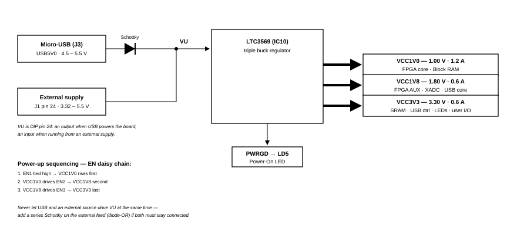

# Cmod A7-35T Power Specification

## 1. Overview

The Cmod A7-35T uses a Linear Technology LTC3569 triple-output buck regulator (IC10) to generate all onboard supply voltages from a single input rail called VU.

*Figure 1. Cmod A7 power supply tree*

---

## 2. Power Input Options

The board can be powered from either of the following sources:

| Source | Connector | Schematic Net | Min Voltage | Recommended | Max Voltage |
|--------|-----------|---------------|-------------|-------------|-------------|
| USB | J3 (Micro-USB) | USB5V0 | 4.5 V | 5.0 V | 5.5 V |
| External Supply | J1 Pin 24 (DIP) | VU | 3.32 V* | 5.0 V | 5.5 V |

> \* The minimum external voltage on VU depends on the current drawn from the VCC3V3 rail via the Pmod header:
>
> - 0 mA drawn: minimum 3.32 V
> - 100 mA drawn: minimum 3.38 V
> - 250 mA drawn: minimum 3.48 V

The GND reference is on J1 Pin 25.

---

## 3. Output Power Rails

All three rails are generated by the LTC3569 from the VU input.

| Rail | Typical Voltage | Min / Max Voltage | Max Current | Powered Devices |
|------|----------------|-------------------|-------------|-----------------|
| VCC1V0 | 1.00 V | 0.95 V / 1.05 V | 1.2 A | FPGA Core, Block RAM |
| VCC1V8 | 1.80 V | 1.71 V / 1.89 V | 0.6 A | FPGA AUX, ADC, USB Core |
| VCC3V3 | 3.30 V | 3.135 V / 3.465 V | 0.6 A | SRAM, USB Controller, Pmod, LEDs, Buttons, FPGA User I/O |

### Power-Up Sequence

The LTC3569 enable pins are daisy-chained to enforce a sequential startup:

1. VCC1V0 starts first (EN1 is tied high).
2. VCC1V8 starts after VCC1V0 is stable (EN2 is driven by VCC1V0).
3. VCC3V3 starts after VCC1V8 is stable (EN3 is driven by VCC1V8).

The PWRGD (Power Good) output drives the Power On LED (LD5).

---

## 4. VU Pin Behavior

| Condition | VU Pin Function |
|-----------|----------------|
| USB connected | Output. Driven from USB 5 V through a Schottky diode; approximately 5 V after the diode drop |
| USB not connected | Input. Accepts an external supply of 3.32–5.5 V |

---

## 5. Dual Power Source (USB + External)

The on-board Schottky diode is located on the USB side (between USB VBUS and VU), not on the VU input pin. The resulting behavior is as follows:

| Scenario | Safe? | Notes |
|----------|-------|-------|
| USB only | ✓ | Normal operation |
| External only (VU pin) | ✓ | Normal operation |
| Both connected, only one active | ✓ | The inactive source supplies no current, no conflict |
| Both connected **and both supplying power** | ✗ | Two voltage sources fight on the same VU node |
| Both connected and both active, **with external Schottky added** | ✓ | Higher-voltage source wins; lower is blocked |

**Note:** Physically connecting both cables is not itself hazardous. The hazard arises when both sources actively supply voltage at the same time without isolation.

If both sources must be connected and powered simultaneously (e.g., USB for JTAG/UART while operating from an external supply), add a Schottky diode in series with the external supply on the VU pin. This creates a diode-OR circuit in which the source with the higher voltage supplies the load and the other source is blocked.

---

## 6. Warnings

- When a USB host is attached, the VU pin is driven to USB voltage (4.5–5.5 V). Any external power source on VU **must be disconnected** before USB is connected, or the external supply may be damaged.
- This is **especially dangerous with battery power sources**, as batteries cannot tolerate reverse current.
- The FPGA I/O pins on the DIP connector have no series resistors. The Artix-7 absolute maximum input rating is VCCO + 0.55 V = **3.85 V** (and –0.4 V minimum, per DS181). The pins are **not 5 V tolerant**; use a level shifter or divider for 5 V devices.

---

## 7. Quick Reference for External Power Design

| Parameter | Value |
|-----------|-------|
| Input Connector | J1 Pin 24 (VU) + Pin 25 (GND) |
| Recommended Input Voltage | 5.0 V |
| Acceptable Input Range | 3.32 – 5.5 V |
| Total Max Current (all rails) | ~2.4 A (1.2 + 0.6 + 0.6) |
| Power Good Indicator | LD5 (LED) |
| Regulator IC | LTC3569 |
| Protection Required for Dual Supply | Schottky diode in series with VU |
