# Standalone Boot Mode — Vitis Unified IDE

This guide describes how an application is stored in the QSPI flash and
started automatically at power-on. A small bootloader (AMD's standard
SREC SPI Bootloader, carried inside the hardware image) copies the
application from flash into SRAM and starts it, with no PC attached, in
under a second after power is applied.

The walkthrough covers the complete path: building the bootloader,
merging it into the hardware image, converting an application to a flash
image, and programming both into the flash. Everything after the hardware
image itself is done in the Vitis Unified IDE.

---

## 1. How Standalone Boot Works

```
Power-on ──► FPGA configures itself from QSPI flash (<1 s)
        ──► Bootloader (in Block RAM, part of the hardware image) starts
        ──► Reads the application image (SREC) from flash @ 0x220000
        ──► Copies it to the addresses the image names (SRAM)
        ──► Jumps to the application's entry point
```

The flash holds two independent regions, read by two different readers:

| Flash offset | Contents | Read by |
|---|---|---|
| `0x000000–0x21FFFF` | Hardware image (bitstream, with the bootloader in its Block RAM initialization) | The FPGA configuration engine, at power-on |
| `0x220000–0x3FFFFF` | Application slot (SREC image, 1.875 MB) | The bootloader |

Block RAM is volatile, so the bootloader cannot live there across a power
cycle. Its persistent copy travels inside the bitstream: a bitstream
carries the initial contents of every block RAM, and the CPU's local
memory is built from block RAM. At every power-on the configuration
engine reloads the bitstream from flash, which restores the bootloader.
Like a mask ROM, it cannot be corrupted from software. The CPU then
leaves reset at address `0x0` and executes it.

The application is stored as an SREC image (Motorola S-record), a text
format in which every line carries its own destination address. The
bootloader copies each record to the address it names, so the linker
script decides where the program runs. The course template links to SRAM
at `0x6000_0000`, so the image is loaded there.

| Memory | Size | Role |
|---|---|---|
| QSPI flash | 4 MB | hardware image + bootloader · application slot @ `0x220000` (non-volatile) |
| SRAM @ `0x60000000` | 512 KB | where the application executes (code/data/heap, I/D-cached) |
| BRAM @ `0x00000000` | 128 KB | 32 KB bootloader · 32 KB ITCM @ `0x8000` · 64 KB DTCM @ `0x10000` |

> **Note:** The repository ships the results of this walkthrough prebuilt in
> `release/`: `boot_srec.bit` is the hardware image with the bootloader
> already merged in. To deploy an application with the stock bootloader,
> skip directly to the application image step.

## 2. Prerequisites

- A workspace with the platform and a built application, prepared as
  described in the JTAG Debug Mode chapter
- The hardware image and its memory map from the repository:
  [`release/top.bit`](../../../release/top.bit) and
  [`release/top_wrapper.mmi`](../../../release/top_wrapper.mmi)
- Cmod A7-35T board connected via its micro-USB cable
- A serial terminal program for the board's console output

---

## 3. Create the Bootloader Component

The bootloader is not custom code: it is the stock **SREC SPI Bootloader**
example that ships with Vitis, built like any other application component.

### 3.1 New Application from Template

Open the **Examples** view from the left activity bar. Under *Embedded
Software Examples*, select **SREC SPI Bootloader** and click **Create
Application Component from Template**.

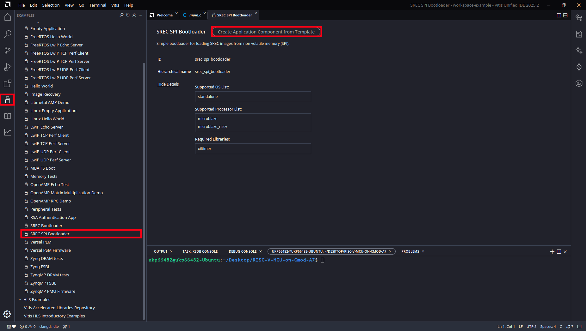

### 3.2 Name and Location

Keep the proposed name `srec_spi_bootloader` and the workspace directory
as the location. Click **Next**.

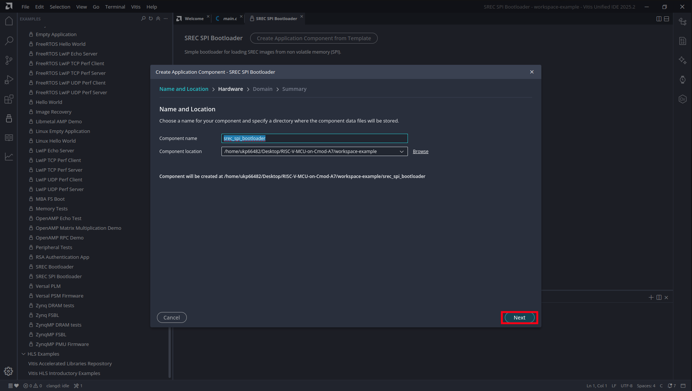

### 3.3 Select the Platform

Select the `platform` component (Board: `cmod_a7-35t`). Click **Next**.

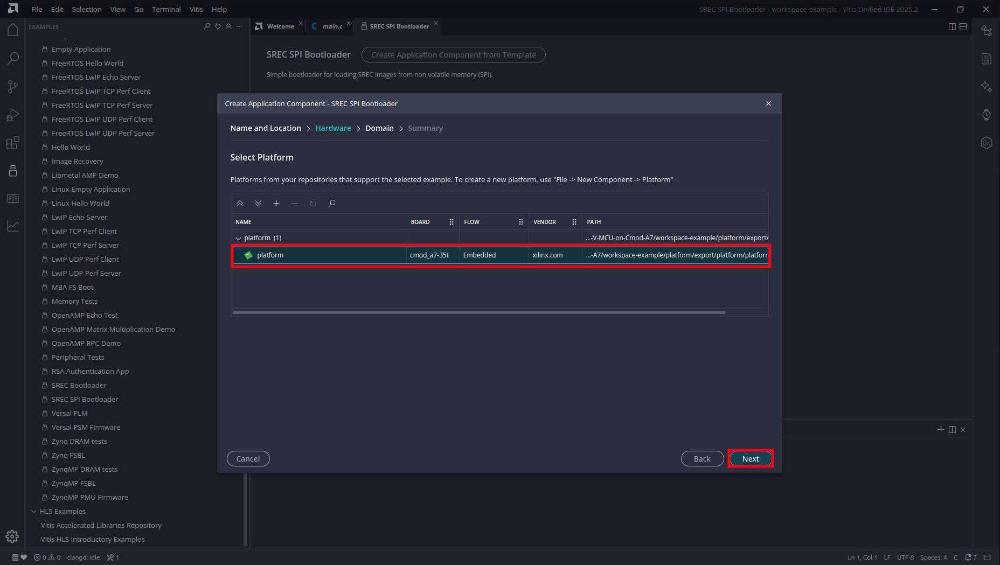

### 3.4 Summary

Review the settings (the domain is `standalone_microblaze_riscv_0`) and
click **Finish**.

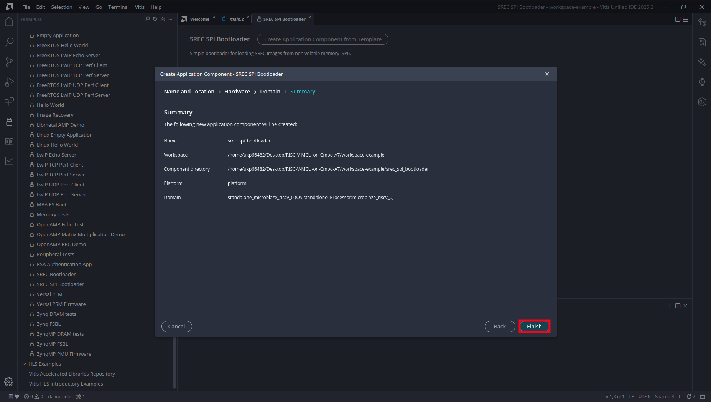

> **Note:** The template automatically selects this board's QSPI flash
> controller, and it links the bootloader to Block RAM at `0x0`, so the
> bootloader can copy an application into SRAM without overwriting itself.
> Neither setting needs to be adjusted.

## 4. Configure the Bootloader

Two source edits configure the template for this board. Both files are
under the component's `src/` folder.

### 4.1 Set the Application Slot Address

`blconfig.h` defines where in the flash the bootloader looks for the
application. The template ships with a placeholder address and a
`#warning` that reminds you to change it:

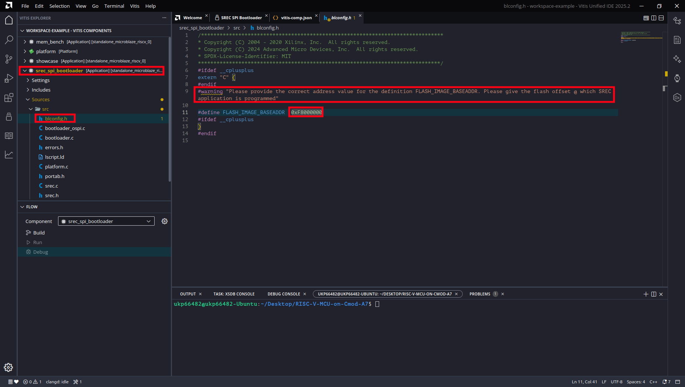

Set `FLASH_IMAGE_BASEADDR` to `0x00220000` (the application slot, which
starts immediately after the bitstream region) and comment out the
`#warning` line:

```c
#define FLASH_IMAGE_BASEADDR  0x00220000
```

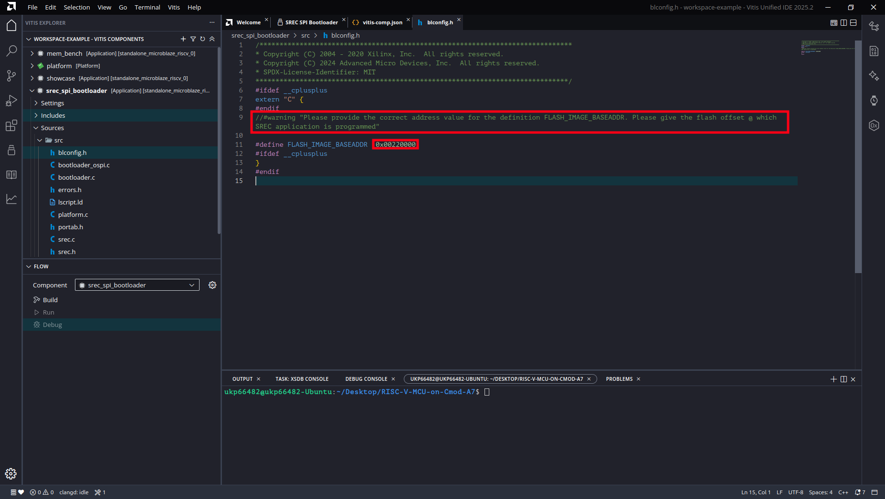

### 4.2 Disable Verbose Output

`bootloader.c` defines `VERBOSE` by default (line 45):

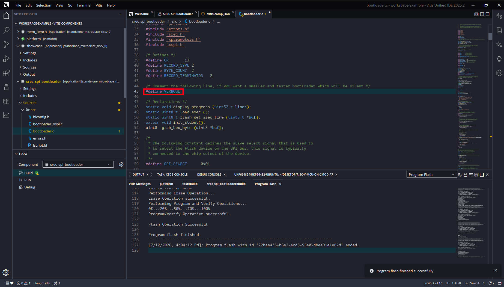

Comment it out:

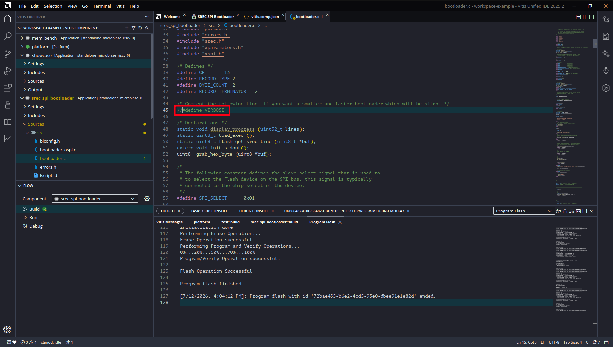

> **Note:** With `VERBOSE` enabled the bootloader prints progress for
> every record it copies, through a UART whose baud divisor it never
> initializes. The application still boots, but loading takes many
> seconds instead of well under one second. Disabling `VERBOSE` gives a
> silent bootloader and restores the sub-second boot. The definition
> returns whenever the template is regenerated, so re-check this line
> when creating a new bootloader component.

## 5. Build the Bootloader

In the **FLOW** panel, set the component to `srec_spi_bootloader` and
click **Build**.

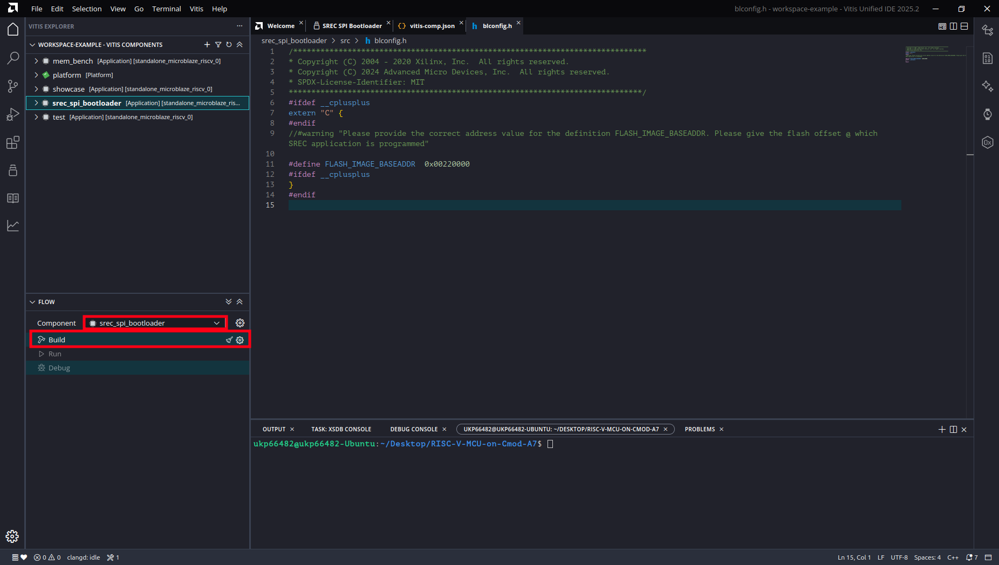

The build produces `srec_spi_bootloader.elf` under the component's
`Output` tree (about 16 KB of code, well inside its 32 KB Block RAM
region).

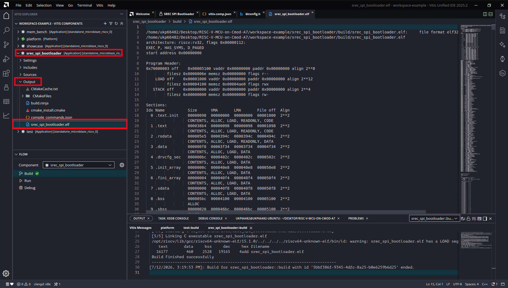

## 6. Merge the Bootloader into the Hardware Image

The bootloader ELF is merged into the bitstream's Block RAM
initialization with `updatemem`, a command-line tool that ships with
Vitis. Only the RAM initialization words change; the logic, routing, and
timing of the hardware image are untouched, so the merge takes seconds
and needs no hardware rebuild.

Open a terminal in the repository root (**Terminal > New Terminal**) and
run:

```bash
updatemem -force \
  -meminfo release/top_wrapper.mmi \
  -data    workspace-example/srec_spi_bootloader/build/srec_spi_bootloader.elf \
  -bit     release/top.bit \
  -proc    top_i/microblaze_riscv_0 \
  -out     release/boot_srec.bit
```

The inputs and what they mean:

| Argument | File | Purpose |
|---|---|---|
| `-meminfo` | `top_wrapper.mmi` | Which physical Block RAM cell holds which CPU address (fixed at hardware placement) |
| `-data` | `srec_spi_bootloader.elf` | The program to place into Block RAM |
| `-bit` | `top.bit` | The hardware image, Block RAM blank |
| `-proc` | `top_i/microblaze_riscv_0` | Which processor's memory to initialize |
| `-out` | `boot_srec.bit` | The bootable hardware image |

> **Note:** A successful run prints `updatemem completed successfully`
> and rewrites the output file. If the tool prints only its usage text,
> one of the paths is wrong and no output is produced; check the output
> file's timestamp before using it. The MMI file must come from the same
> hardware build as the bitstream.

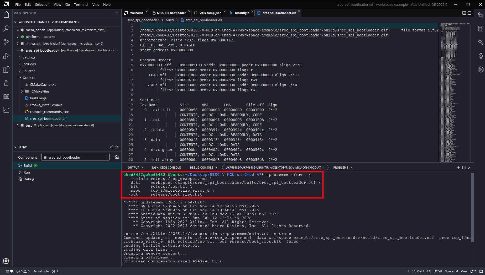

## 7. Prepare the Application Image

The bootloader reads SREC text, so the application ELF is converted with
the toolchain's `objcopy`. This walkthrough deploys the `test`
application built in the JTAG Debug Mode chapter; the same ELF runs
unchanged under JTAG and from flash.

```bash
riscv32-amd-linux-gnu-objcopy -O srec \
  workspace-example/test/build/test.elf \
  workspace-example/test/build/test.srec
```

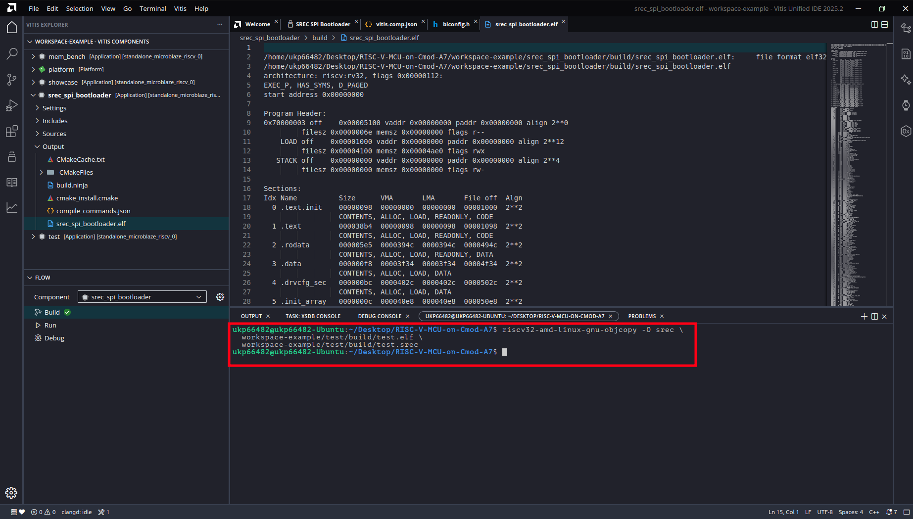

Then give the image a `.bin` extension:

```bash
cp workspace-example/test/build/test.srec \
   workspace-example/test/build/test_srec.bin
```

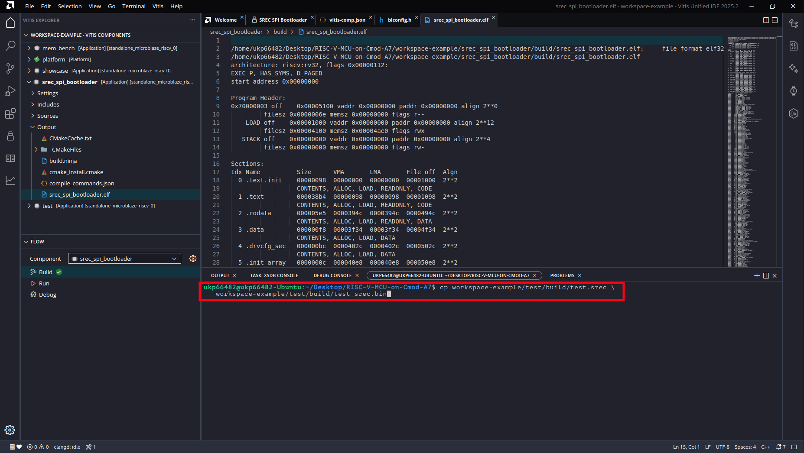

> **Note:** The extension matters. The flash programmer treats a `.srec`
> file as an image format and decodes it to the memory addresses inside
> it; a `.bin` file is written to the flash byte for byte, which is what
> the bootloader expects to find in the slot. The file name itself is
> free; only the `.bin` extension is significant.

Each S3 line of the SREC text embeds its destination address; with the
course linker script every record falls in SRAM (addresses beginning
`6000`). The image is about three times the size of the binary it
encodes; the 1.875 MB slot therefore never limits an application before
the 512 KB SRAM does.

## 8. Program the Flash

Both flash regions are written from **Vitis > Program Flash...** in the
menu bar. Each write erases and programs only the address range of its
own image, so the two regions never disturb each other.

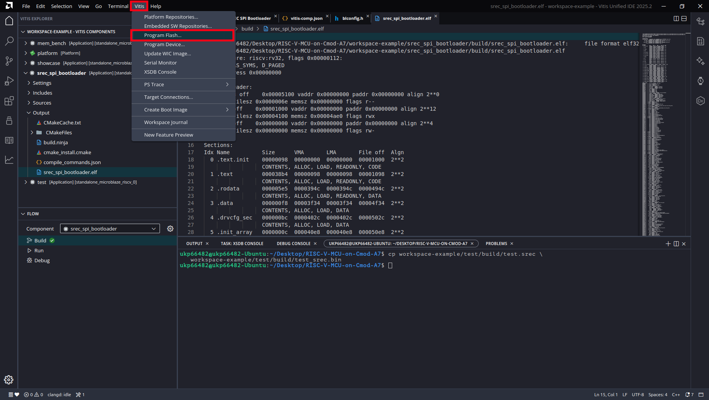

### 8.1 Program the Hardware Image

This step is needed once, and again only after the bootloader or the
hardware design changes. In the *Program Flash Memory* dialog set:

| Field | Value |
|---|---|
| Image File | `release/boot_srec.bit` |
| Offset | `0x0` |
| Flash Type | `mx25l3273f-spi-x1_x2_x4` |
| Verify after flash | checked |

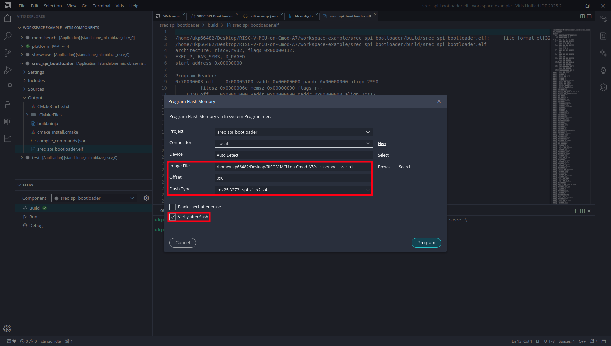

Click **Program** and wait for *Program flash finished.*

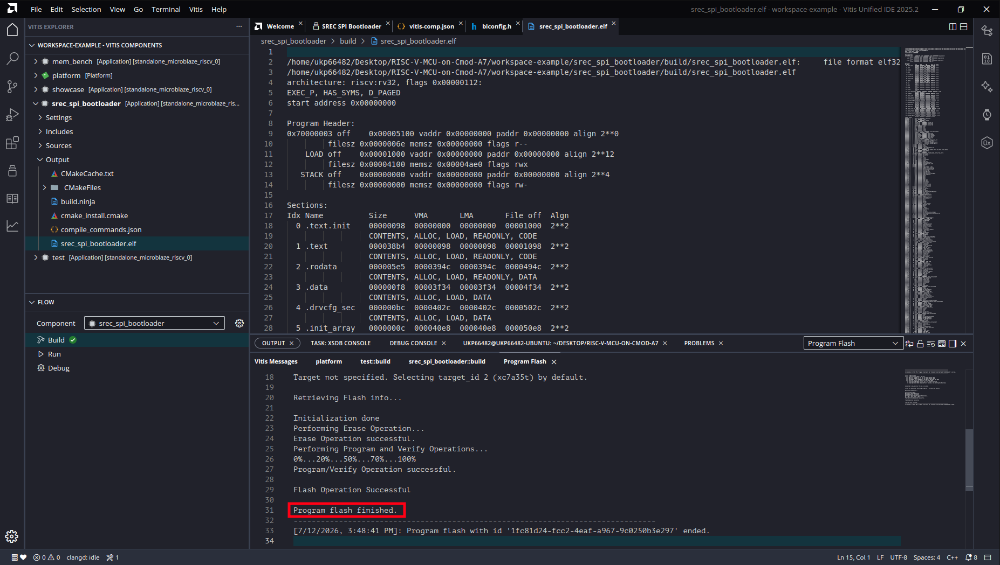

> **Note:** The flash type entry covers the board's Macronix MX25L3273F
> device. Older boards carry a Micron N25Q032A instead; if the IC3 marking
> says N25Q032, select `n25q32-3.3v-spi-x1_x2_x4`.

### 8.2 Program the Application

Open **Vitis > Program Flash...** again and set:

| Field | Value |
|---|---|
| Image File | the `.bin` application image |
| Offset | `0x220000` |
| Flash Type | `mx25l3273f-spi-x1_x2_x4` |
| Verify after flash | checked |

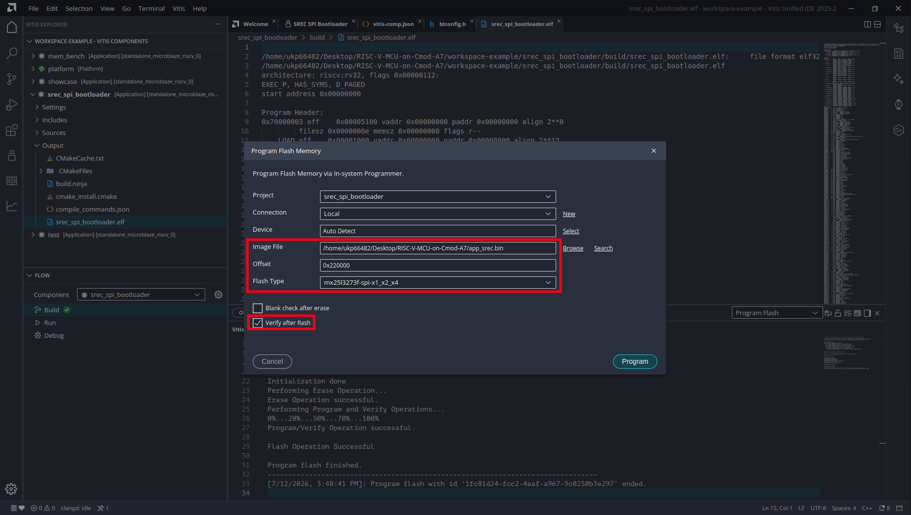

Click **Program** and wait for *Program flash finished.*

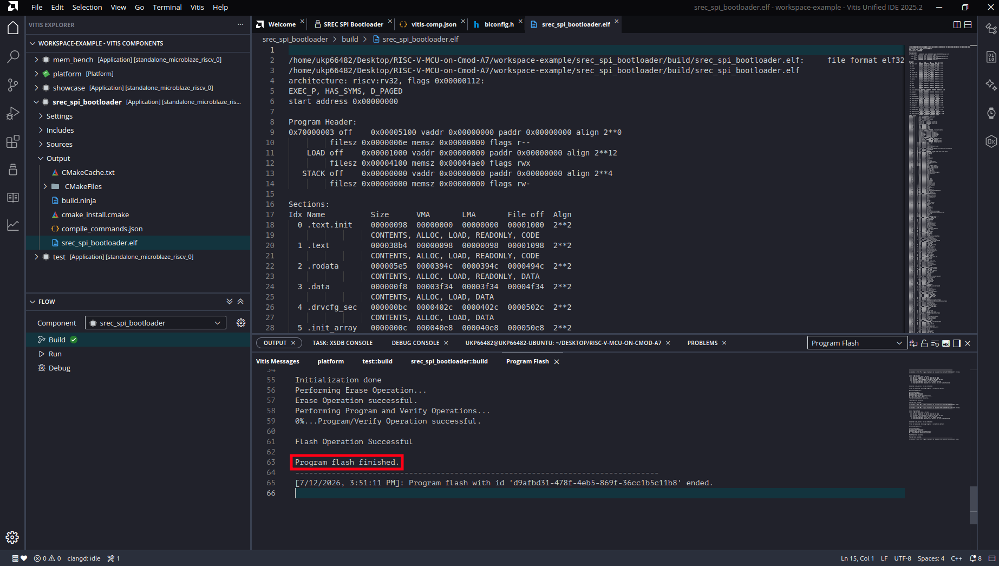

## 9. Boot and Verify

Disconnect the USB cable and plug it back in. This is a true cold boot:
the FPGA configures itself from the flash, the bootloader loads the
application, and the application runs, with no debugger and no IDE
involved.

Open a serial terminal at 115200 8N1 (the Vitis **Serial Monitor**,
GTKTerm, or pyserial's miniterm; the board enumerates as two ports and
the UART is usually the higher-numbered one). The course template prints
its memory tour, followed by the running status output:

```
RISC-V MCU on Cmod A7 - memory tour
  main()       @ 0x600009EC   (SRAM,  cached)
  blink_step() @ 0x00008000   (ITCM,  1-cycle)
  blink_count  @ 0x00010000   (DTCM,  1-cycle)
  stack        @ 0x0001FFC0   (DTCM,  grows down)
```

> **Note:** The reset button (BTN0) restarts the CPU into the bootloader,
> which re-copies the application from flash, so a reset behaves like a
> power-cycle. Modified `.data` globals are restored because the image is
> re-read from flash at every boot.

## 10. Updating the Application

After the one-time setup above, the day-to-day deployment loop has three
steps, none of which touch the bootloader or the hardware image:

1. Build the application in Vitis.
2. Convert and rename the image (the two commands in the application
   image step).
3. **Vitis > Program Flash...** to offset `0x220000`.

Power-cycle, and the new application boots.

## 11. Working with JTAG Debug Mode

Both modes coexist on the same board with no switching:

| | JTAG (Vitis Run/Debug) | Standalone (flash) |
|---|---|---|
| Code goes to | RAM directly (volatile) | Flash (persistent) |
| After power-cycle | the flashed application boots | the deployed application boots |
| Breakpoints / stepping | yes | no |
| Typical use | daily development loop | shipping a finished program |

The typical development cycle is edit, build, and JTAG Run/Debug. When
the program works, deploy it to flash once. JTAG always takes priority
over the bootloader: it halts the CPU before the bootloader runs, so the
flash contents cannot interfere with a debug session.

## 12. Troubleshooting

1. **Boot works but takes many seconds:** `VERBOSE` is still defined in
   `bootloader.c`. Comment it out, rebuild the bootloader, re-run
   `updatemem`, and reprogram the hardware image.
2. **Nothing at all after power-on (no LED, no output):** The flash holds
   `top.bit` (blank Block RAM, no bootloader) instead of
   `boot_srec.bit`, or the hardware image region is empty or corrupt.
   Reprogram the hardware image. JTAG remains available for recovery.
3. **`updatemem` printed only usage text:** One of the argument paths is
   wrong; no output file was written, and reprogramming would flash the
   previous image. Fix the path and confirm the
   `updatemem completed successfully` message.
4. **Program Flash fails with `Flash Operation Failed`:** Another
   process is holding the JTAG connection, typically a Vitis debug
   session or an XSDB console. Close it (or unplug and replug the board)
   and retry.
5. **Garbage on the terminal:** The baud rate must be 115200. The course
   template sets the UART divisor in `mcu_init()`; the plain Hello World
   template does not set it at all.
6. **Deployed, but silent after power-on (works under JTAG):** The ELF
   was not linked with the course template's `lscript.ld`. The bootloader
   honors the SREC record addresses, and a default all-BRAM layout
   collides with the bootloader itself. Rebuild with the template and
   redeploy.
7. **Board boots an old application:** The flash write did not complete.
   Repeat the application programming step and confirm the verify pass
   succeeds.
