# JTAG Debug Mode — Vitis Unified IDE

This guide walks through loading and debugging a MicroBlaze RISC-V application over JTAG using the **AMD Vitis Unified IDE**. JTAG puts your program straight into RAM and hands you a debugger — nothing is written to flash, and a power-cycle returns the board to whatever `upload.py` last shipped.

## Prerequisites

- The hardware design as an `.xsa` file — use the prebuilt [`release/top_wrapper.xsa`](../../../release/top_wrapper.xsa) (no Vivado needed)
- **Vitis Unified IDE 2025.x** installed (the classic pre-2023.2 Vitis GUI looks
  completely different and is not covered here), with its tools on PATH:
  `source /opt/Xilinx/2025.2/Vitis/settings64.sh` (adjust to your install)
- Cmod A7-35T board connected via its micro-USB cable (it carries power, UART,
  and JTAG all at once)
- For the CLI helpers below: run them from the repository root, and install
  `pyserial` if you want the UART tail (see the Standalone guide's prerequisites)

---

## 0. The Fast Path (no GUI)

Two commands take you from a fresh checkout to a running program:

```bash
python3 tools/vitis_new_app.py myapp        # create + build (first run also builds the platform)
python3 tools/jtag_run.py workspace-example/myapp/build/myapp.elf
```

`vitis_new_app.py` performs sections 1–7 of this guide for you (workspace,
platform with `uart_USB` stdin/stdout, application from the course template,
build). `jtag_run.py` is section 8's **Run** button as a command, and tails the
UART so you immediately see:

```
RISC-V MCU on Cmod A7 - memory tour
  main()       @ 0x600009D0   (SRAM,  cached)
  blink_step() @ 0x00008000   (ITCM,  1-cycle)
  ...
```

The result is a normal Vitis project — open the workspace in the GUI any time
for breakpoints and stepping.

**First time here?** Do the GUI walkthrough (sections 1–8) once so you know
what the script does on your behalf; afterwards use the two commands for every
new app. If you already ran the fast path, open `workspace-example` in the GUI
and jump straight to section 8 — do **not** re-create the `platform` component
the script already made.

---

## 1. Open Vitis Workspace

Launch the Vitis Unified IDE. On the Welcome page, click **Open Workspace** to select or create a working directory — use the repo's `workspace-example/` folder, which is what the fast-path scripts, the template paths, and this guide all assume (any empty folder also works if you adjust the paths yourself).

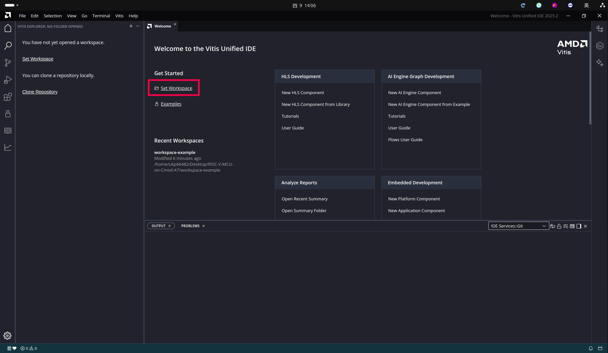

---

## 2. Create a Platform

### 2.1 New Platform Component

From the menu bar, select **File > New > Platform** to create a new platform component.

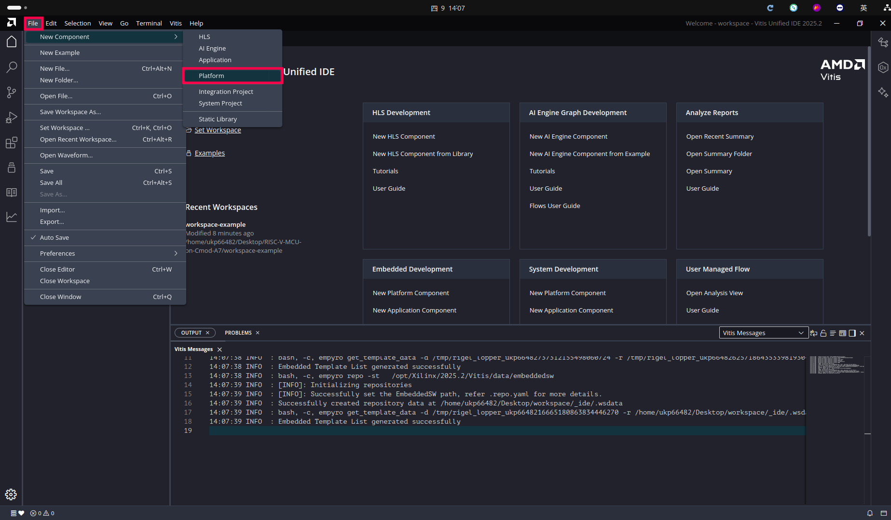

### 2.2 Name and Location

On the **Name and Location** page:

- **Component name**: enter `platform`
- **Component location**: choose your workspace directory

Click **Next** to continue.

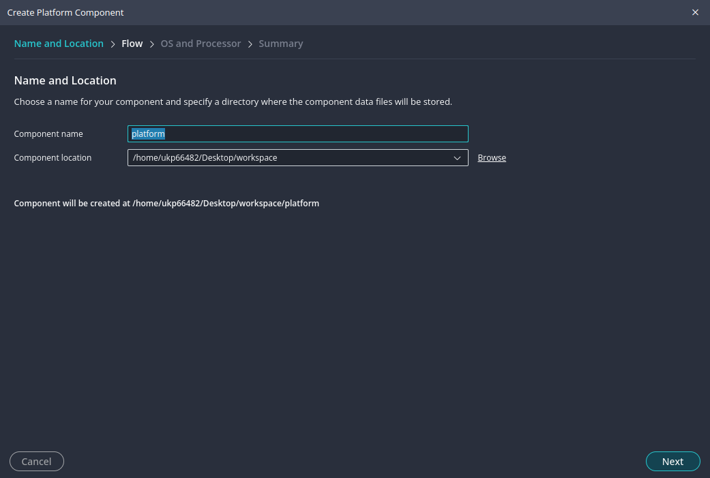

### 2.3 Select Hardware Design (XSA)

On the **Flow** page:

- Select **Hardware Design**
- In the **Hardware Design (XSA) For Implementation** field, browse to the
  prebuilt `release/top_wrapper.xsa` (or your own Vivado export)

Wait for the tool to create the System Device Tree and retrieve processor
details — it takes under a minute; it is done when the next page can list
`microblaze_riscv_0`.

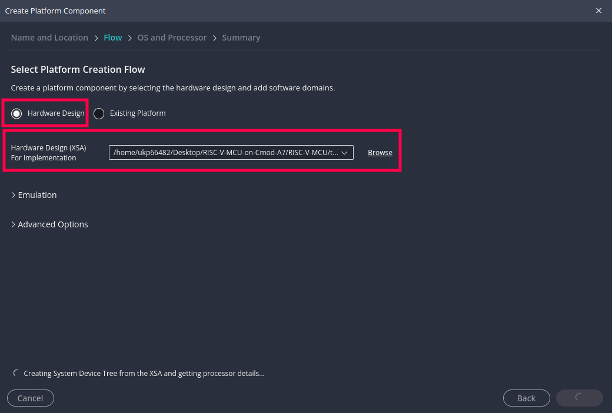

### 2.4 Select Operating System and Processor

On the **OS and Processor** page:

- **Operating system**: `standalone`
- **Processor**: `microblaze_riscv_0`

Click **Next** to finish.

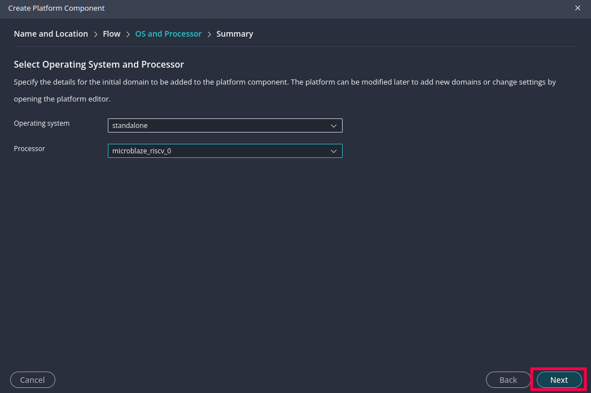

### 2.5 Platform Created

Once created, Vitis displays the platform's Domain settings where you can verify the processor and configuration.

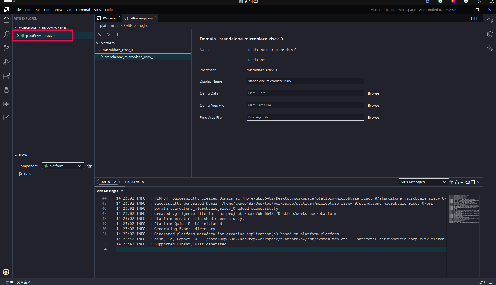

---

## 3. Create an Application

### 3.1 Create from Template

Open the **Examples** view (icon in the left activity bar, also linked from the Welcome page — see the screenshot). In the left-side template list, select **Hello World**, then click **Create Application Component from Template**.

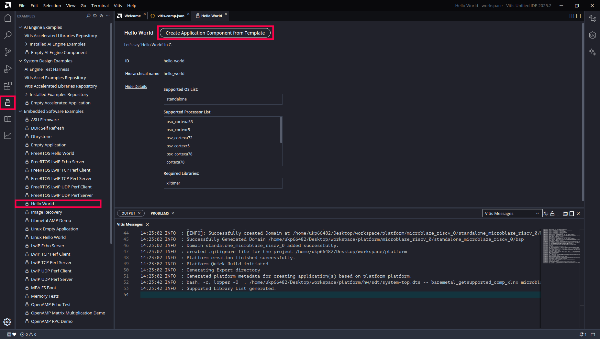

### 3.2 Set Application Name

On the **Name and Location** page:

- **Component name**: enter your application name (e.g. `GPIO_test`)

Click **Next** to continue.

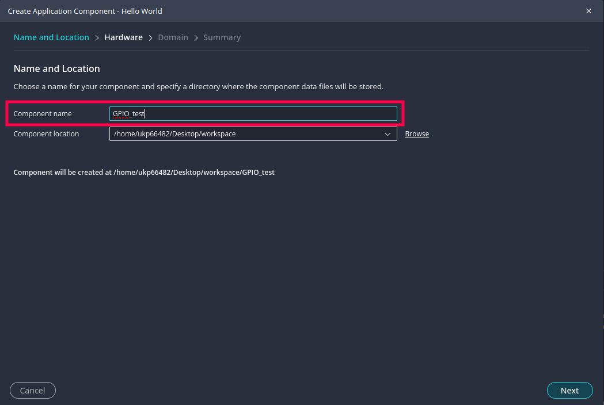

### 3.3 Select Platform

On the **Hardware** page, select the previously created **platform** (Board: `cmod_a7-35t`).

Click **Next** to continue.

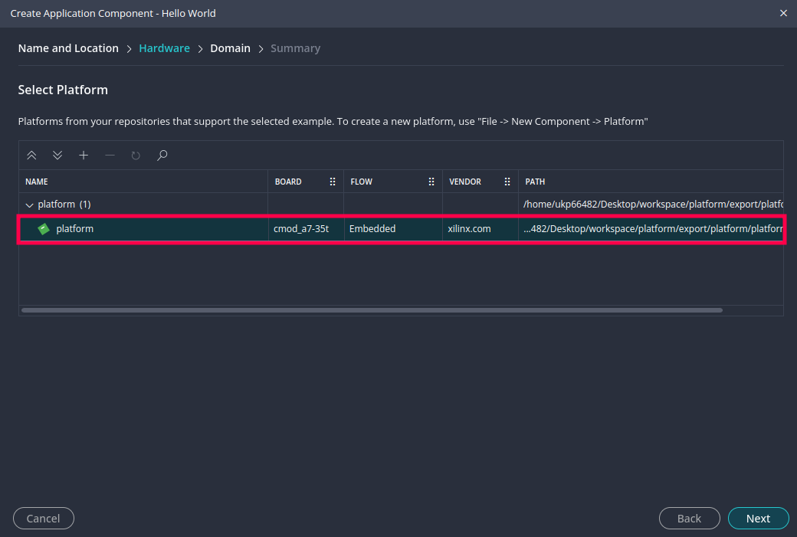

### 3.4 Review Summary and Finish

Review the application settings:

| Field | Value |
|---|---|
| Name | GPIO_test |
| Platform | platform |
| Domain | standalone_microblaze_riscv_0 (OS:standalone, Processor:microblaze_riscv_0) |

Click **Finish** to create the application.

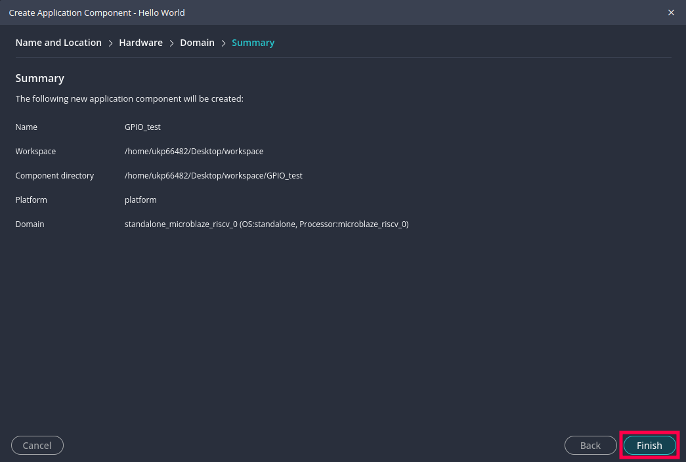

---

## 4. Write Application Code

### 4.1 Default Source Code

After creation, a default `helloworld.c` file is placed in the `src` directory.

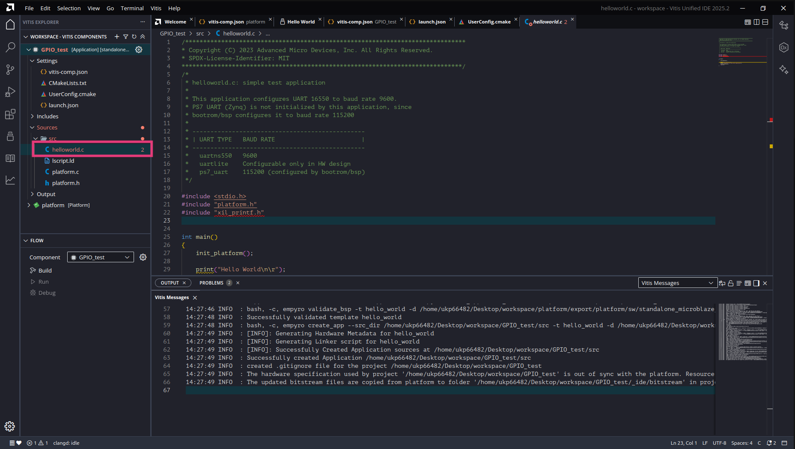

**Replace it with the course template.** A Vitis component's `src/` is a plain
folder on disk, so do the copy in a file manager or terminal (paths relative to
the workspace, here `workspace-example/`):

```bash
cd workspace-example
cp SRAM_app_template/src/main.c SRAM_app_template/src/lscript.ld GPIO_test/src/
rm GPIO_test/src/helloworld.c
```

Overwrite `lscript.ld` when asked — the generated one is the small all-BRAM
default you are replacing. Afterwards the Explorer's `src/` shows exactly
`main.c` and `lscript.ld`:

- `main.c` — starts with `mcu_init()` (the template's one rule: keep it as the
  first line of `main()`) and prints a memory tour at boot
- `lscript.ld` — places code in SRAM, the stack in DTCM, and provides the
  `ITCM_FUNC` / `DTCM_DATA` fast-memory attributes

Files inside `src/` are compiled automatically — this swap needs no build
configuration.

### 4.2 Add Source Files

Add more source files under the `src` directory as your project grows (e.g. `gpio_init.c`). Assembly files (`.S`) are also supported — add them the same way and they will be compiled and linked together with the rest of the project. See [`workspace-example/examples/02_btn_led_asm/`](../../../workspace-example/examples/02_btn_led_asm/) for an example written entirely in RISC-V assembly.

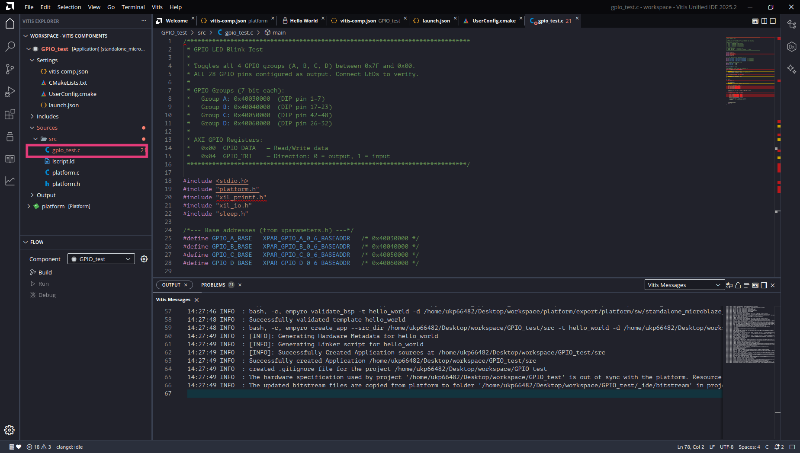

### 4.3 Configure Compile Sources

Sources inside `src/` build automatically. **UserConfig.cmake** (Explorer → your component → **Settings**) is for files you keep *outside* `src/` — open its **Sources > Compile sources** section to add them:

1. Click **Browse** to select files
2. Verify the file appears in the list
3. Use **Delete** to remove unwanted entries

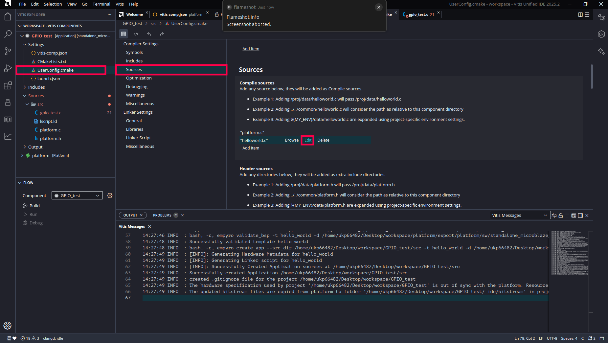

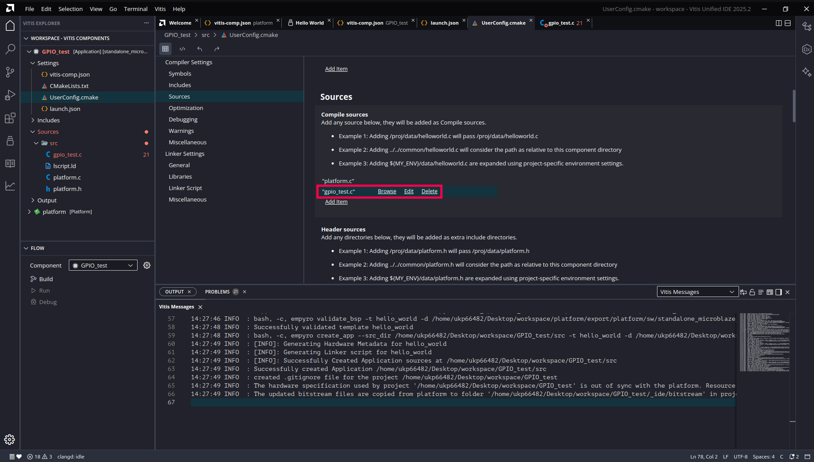

---

## 5. Configure the Linker Script

### 5.1 Memory Region Settings

Open the **Linker Script** settings page (Explorer → your component →
**Settings** → *Linker Script*):

- **Available Memory Regions**: you should see the template's three — `sram`
  (512 KB), `itcm` (32 KB), `dtcm` (64 KB)
- **Stack Size / Heap Size**: the template defaults (8 KB / 2 KB) are fine —
  treat this page as read-only unless a build error tells you otherwise

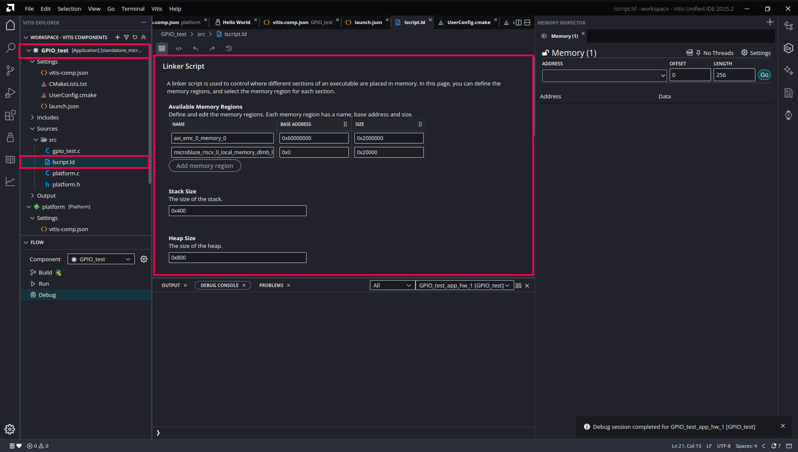

### 5.2 Section to Memory Region Mapping

Verify the section-to-region mapping: everything (`.text`, `.data`, `.bss`, `.heap`, …) in `sram`, except `.stack` in `dtcm` and `.itcm.text` in `itcm`.

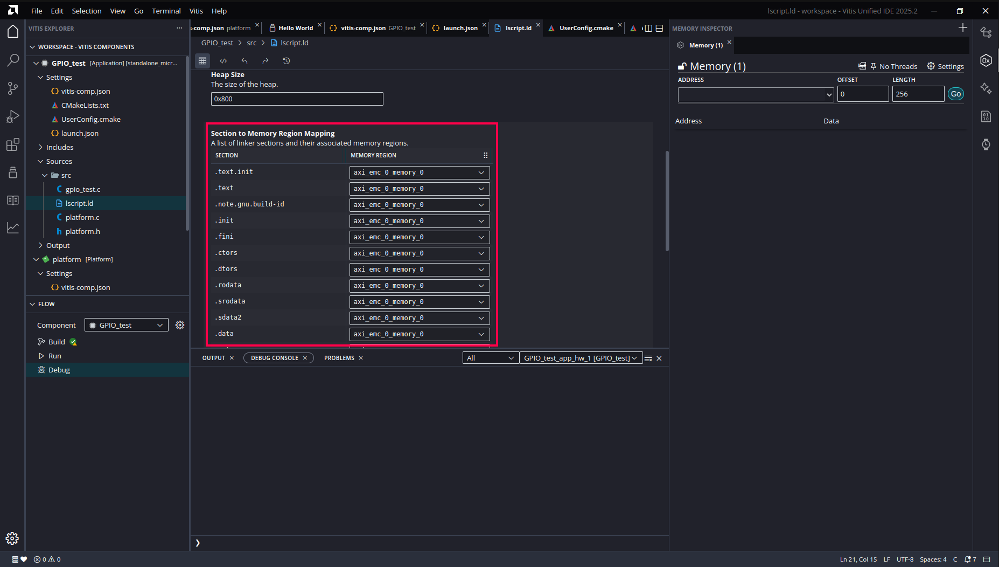

> **Note:** the Vitis-generated default linker script places everything in the
> 128 KB BRAM — fine for a quick Hello World over JTAG, but small, and the
> layout collides with the bootloader flow. The course template's
> [`lscript.ld`](../../../workspace-example/SRAM_app_template/src/lscript.ld)
> (already copied in §4.1) fixes this: code/data in 512 KB SRAM, stack in DTCM,
> `ITCM_FUNC`/`DTCM_DATA` support — and the same ELF then also works with
> `upload.py`. See the
> [Standalone Boot Mode guide](../Standalone-Boot-Mode/Standalone-Boot-Mode.md) §3.
> Use this GUI page to *view* the regions or resize stack/heap — don't let it
> regenerate the script (that would discard the template's ITCM/DTCM layout).

---

## 6. Configure Platform BSP

Open the platform's **Configuration for Os: standalone** settings page and verify the following key parameters:

- **stdin** and **stdout**: set both to **`uart_USB`**. The default may be
  `uart_1` (the DIP-pin UART) — with that setting `xil_printf` output never
  reaches your USB terminal. (Platforms created by `tools/vitis_new_app.py`
  already have this preset.)
- Adjust other BSP settings as needed

The project-wide serial convention is **115200 8N1**. The course template
needs nothing here — its `mcu_init()` already sets 115200. **Only if** you kept
the stock `helloworld.c` (which prints at whatever rate the UART was last set
to), add
`XUartNs550_SetBaud(XPAR_UART_USB_BASEADDR, XPAR_XUARTNS550_0_CLOCK_FREQ, 115200);`
at the top of its `main()`.

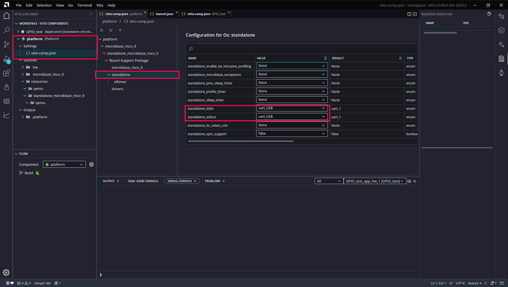

---

## 7. Build

### 7.1 Build the Platform

In the **FLOW** panel at the bottom-left, select the **platform** component and click **Build**.

Wait for the build to complete — confirm the log shows `Platform Build Finished Successfully`.

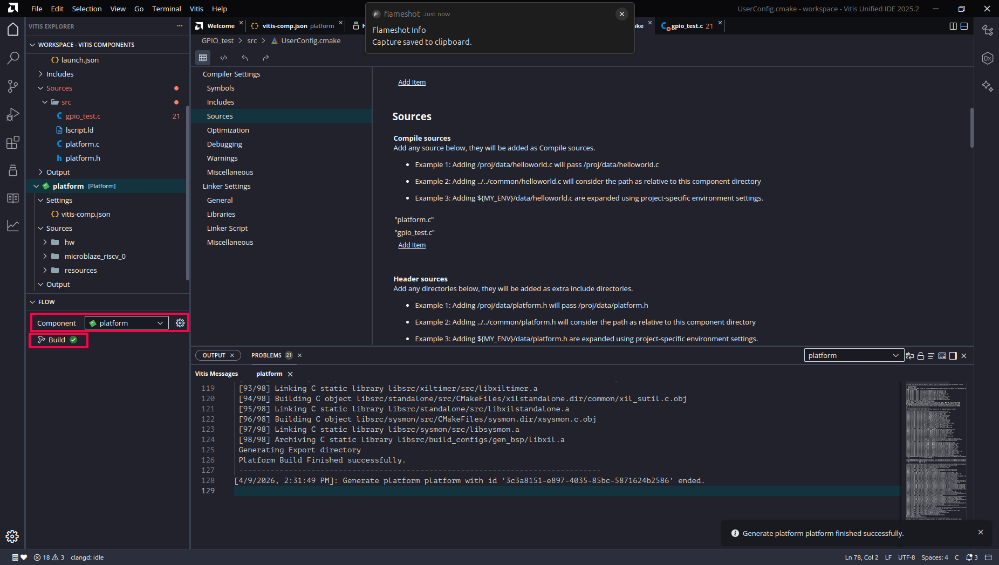

### 7.2 Build the Application

Switch to the application component (e.g. `GPIO_test`) and click **Build**.

Verify the build succeeds and produces the `.elf` file at
`<workspace>/GPIO_test/build/GPIO_test.elf`.

> **Note:** During the build, Vitis automatically links in `boot.S` and `crt.o` from the standalone BSP. You do not need to provide them manually.
> - **`boot.S`** — the first code that runs after reset. It zeros all general-purpose registers (x0–x31), initializes the stack pointer, sets up exception/interrupt vectors, and jumps to the C runtime entry point.
> - **`crt.o`** (C Runtime) — runs before `main()`. It zeros the BSS segment (uninitialized global variables) and then calls `main()`.

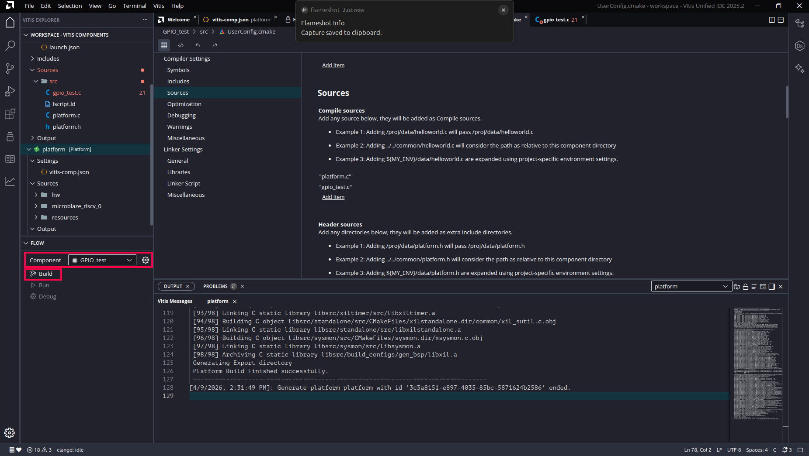

---

## 8. Run and Debug over JTAG

### 8.1 Run the Application

Before debugging, you can first run the application to verify it works correctly. In the **FLOW** panel, click **Run**.

Vitis will automatically:
1. Download the bitstream to the FPGA via JTAG
2. Load the `.elf` into the MicroBlaze RISC-V processor
3. Execute the program from start to finish

**✔ Checkpoint** — open a 115200-baud terminal **before** clicking Run. The
board shows up as two serial ports; the UART is usually the higher-numbered
(e.g. `/dev/ttyUSB1`) — `python3 -m serial.tools.miniterm /dev/ttyUSB1 115200`
works anywhere pyserial is installed (Ctrl-] quits). Or skip the terminal and
use `python3 tools/jtag_run.py <elf>`, which loads, runs, and tails the UART in
one go. The template prints its memory tour **once at boot** — missed it? just
click Run again. The two board LEDs blinking is an independent sign the program
is alive. If the tour's addresses show SRAM/ITCM/DTCM as in §0, everything —
linker script, BSP, UART — is wired correctly.

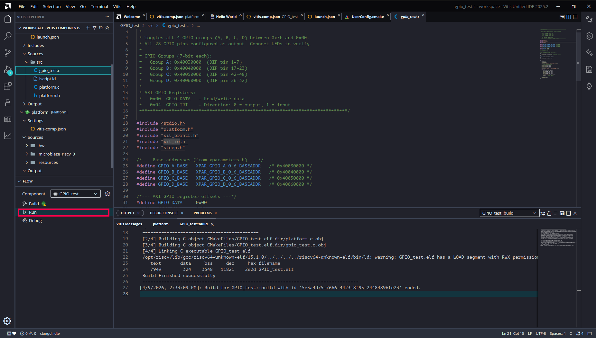

### 8.2 Start a Debug Session

Once the application is verified, click **Debug** in the **FLOW** panel to launch a debug session. This works similarly to GDB — the program is loaded and paused at `main()`, allowing you to inspect and step through the code interactively.

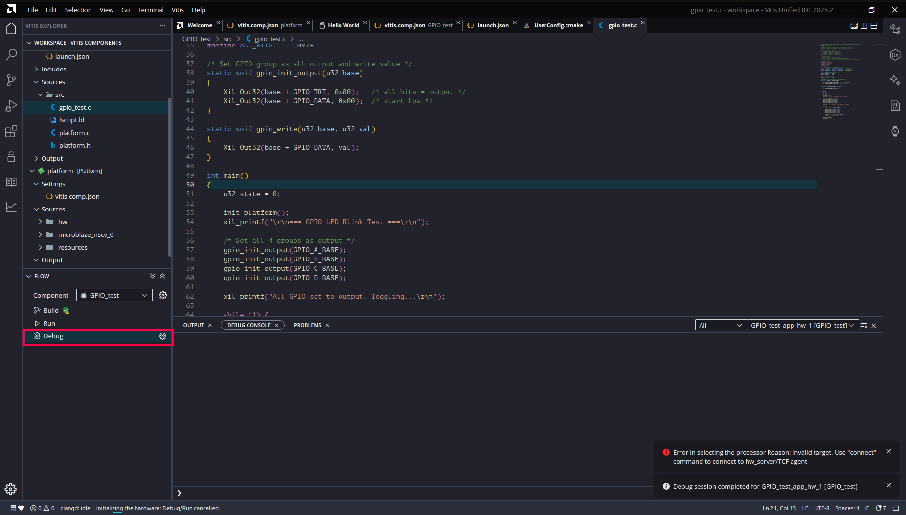

### 8.3 Debug Controls

In the Debug view, the left panel provides:

- **THREADS**: thread information
- **CALL STACK**: call stack trace
- **VARIABLES**: variable inspection
- **WATCH**: watch expressions
- **BREAKPOINTS**: breakpoint management

The toolbar at the top provides **Continue**, **Step Over**, **Step Into**, **Step Out**, and other debug controls.

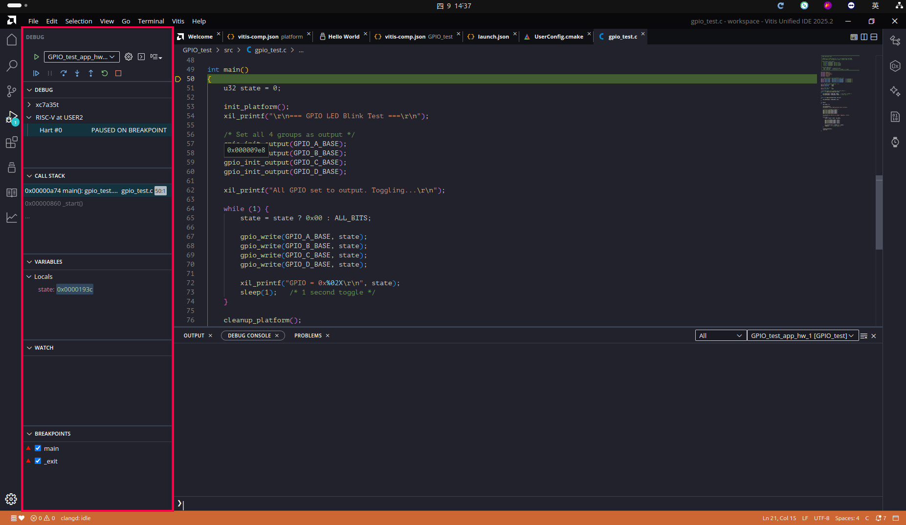

### 8.4 Breakpoints and Stepping

Click in the gutter area next to a line number to set a breakpoint. Use Step Over / Step Into to step through the code line by line.

---

## 9. Advanced Inspection Tools

### 9.1 Open the Register Inspector

From the menu, select **View > Register Inspector** to open the register inspection panel.

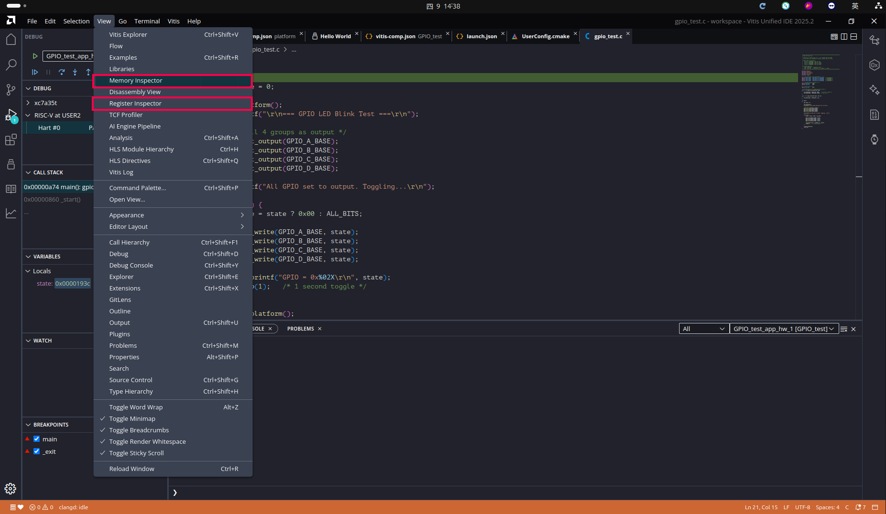

### 9.2 View Register Contents

The Register Inspector displays all processor registers and their current values, including:

- General-purpose registers (x0 – x31)
- Program Counter (PC)
- HEX values and descriptions for each register

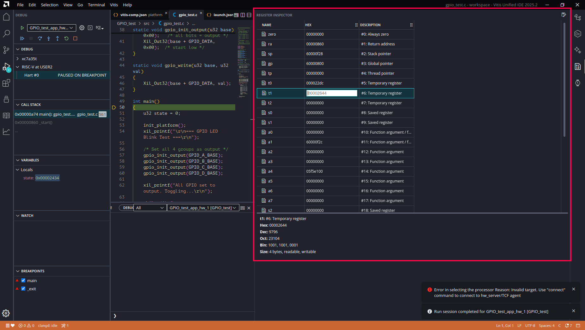

### 9.3 View Memory Contents

Open the **Memory Inspector** panel to:

- Enter a memory address (e.g. `0x60000000`) to inspect a specific memory region
- View data in hexadecimal format
- Monitor memory changes in real time

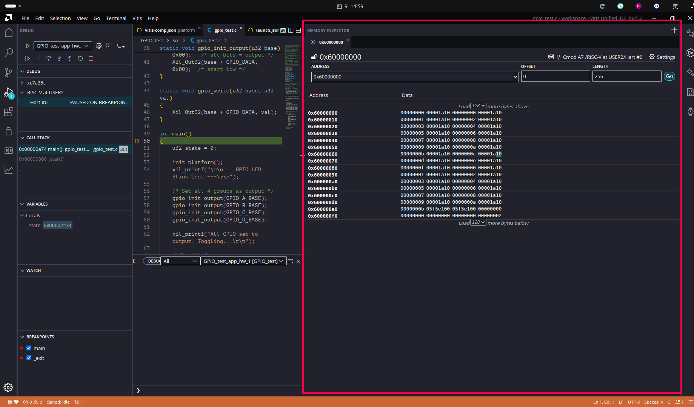
